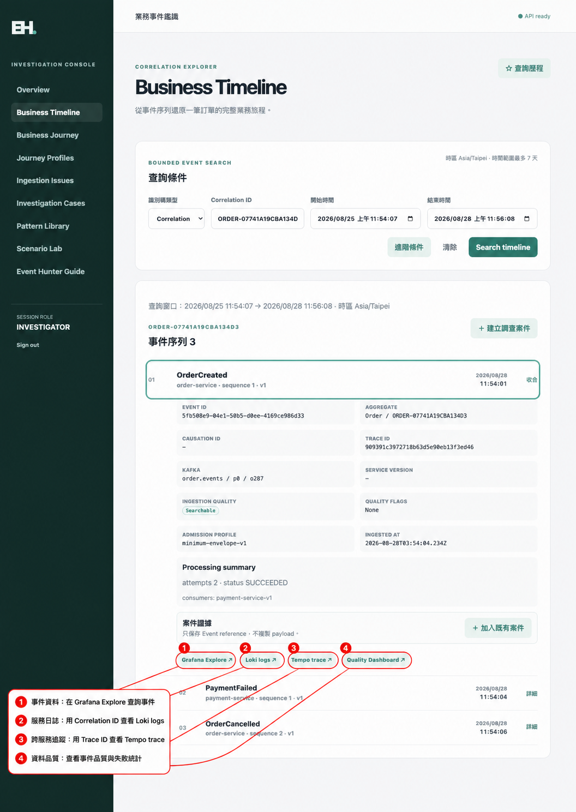

# Event Hunter

Event Hunter 是一套從「業務事件」出發的事故調查平台。它把分散在 Kafka、ClickHouse、Logs 與
Traces 的資訊，用同一個 `Correlation ID` 串成容易理解的業務脈絡。

它主要回答這幾個問題：

- 這筆訂單經歷了哪些事件？
- 流程停在哪個業務里程碑？
- 是否出現重複、亂序、缺少事件或 ingestion 問題？
- 哪些 Logs 與 Traces 和這筆業務有關？
- 是否需要建立案件，保存證據並交給其他人處理？

Event Hunter 不取代 Grafana，也不是正式業務系統。Grafana 負責 Logs、Metrics、Traces 與 Alerting；
Event Hunter 負責把這些技術訊號連回 Business Timeline、Journey、Pattern 與 Investigation Case。

## 可以做什麼

| 功能 | 用途 |
|---|---|
| Overview／Smart Search | 使用 Correlation、Trace、Event 或 Aggregate ID 快速定位業務資料 |
| Business Timeline | 依時間還原 Domain Events 與 processing attempts |
| Business Journey | 用 Journey Profile 對照預期里程碑，找出流程進行到哪裡 |
| Ingestion Issues | 查看格式、admission 與 connector technical DLQ 問題的安全摘要 |
| Investigation Cases | 建立案件、指派、記錄 Notes、Evidence、Finding、Root cause 與 Resolution |
| Pattern Library | 執行固定、可測試且唯讀的業務異常規則 |
| Scenario Lab | 執行 S1～S14 情境，快速產生可供 Timeline 與 Journey 查詢的資料 |
| Event Hunter Guide | 查看操作方式、外部系統接入與調查 Runbook |

目前完成的是 Phase 1.1：搜尋、調查、案件協作、Pattern、Scenario Lab、Grafana deep links 與
OpenTelemetry 整合。Temporal workflow、Projection Rebuild 與 Sandbox Replay 尚未接入，也不是目前
操作 Event Hunter 的必要條件。

## 快速啟動

需要 Docker 與 Docker Compose。第一次啟動會下載並建立多個本機容器。

```bash
git clone https://github.com/zhjiangexe/event-hunter.git
cd event-hunter

# 選用；不建立 .env 也會使用 compose.yaml 的本機預設值
cp .env.example .env

bash scripts/dev-up.sh
```

啟動完成後開啟：

- Event Hunter：<http://localhost:28334/login>
- Grafana：<http://localhost:28332>

Event Hunter 本機登入頁不需要帳號密碼，可直接選擇 `Viewer`、`Investigator` 或 `Admin` 示範角色。
一般操作建議使用 `Investigator`。

常用維護命令：

```bash
bash scripts/dev-status.sh   # 查看服務狀態
bash scripts/dev-down.sh     # 停止容器，但保留資料 volumes
bash scripts/dev-up.sh       # 再次啟動並補齊 migration、topics 與 connectors
```

完整 port、持久化與故障處理請看 [Local development infrastructure](infra/README.md) 和
[Operations Runbook](requirements/operations-runbook.md)。

## 第一次使用

最容易理解 Event Hunter 的方式是先執行一個 Scenario：

1. 登入後開啟 **Scenario Lab**。
2. 執行 `S1 正常訂單出貨`，取得 `Run ID` 與 `Correlation ID`。
3. 複製 `Correlation ID`，到 **Business Timeline** 查詢事件序列。
4. 開啟 **Business Journey**，查看 Order、Payment、Delivery 等里程碑。
5. 從事件詳細資訊開啟 Grafana Logs 或 Trace。
6. 若需要協作與保存調查結果，再建立 **Investigation Case**。

`S1`、`S12`～`S14` 會呼叫真實的 Order／Payment／Shipping demo services；`S2`～`S11` 使用隔離的
synthetic topic 模擬缺少事件、重複、亂序、DLQ、配送與退貨等情境。

### 從事件深入調查

在 Business Timeline 展開事件後，可直接把目前事件的識別碼與時間範圍帶到 Grafana：



- **Grafana Explore**：查詢 ClickHouse 保存的事件資料。
- **Loki logs**：用 `Correlation ID` 查看相關服務執行過的動作與事件發布紀錄。
- **Tempo trace**：用 `Trace ID` 查看同一次請求的跨服務呼叫路徑。
- **Quality Dashboard**：查看該時段的事件品質、admission 與失敗統計。

## 外部系統如何接入

接入 Event Hunter 的系統需要提供兩類資訊：

1. 將符合 canonical envelope 的 Domain Events 發布到約定的 Kafka topics。
2. 將 OpenTelemetry traces、logs 與 metrics 送到 Event Hunter 使用的 OTel Collector。

最重要的事件識別欄位包括：

- `eventId`：唯一識別單一事件。
- `correlationId`：串起同一段業務旅程。
- `traceId`：連到分散式 Trace。
- `aggregateType`／`aggregateId`：識別事件所屬 Aggregate。
- `eventType`／`eventVersion`／`occurredAt`：描述事件種類、版本與發生時間。

Event Hunter 的 Timeline 查詢 ClickHouse 保存的 read model，不直接即時讀取 Kafka。完整 ingestion、
Outbox、Trace Context 與資料儲存流程請看 [Current Architecture](requirements/current-architecture.md)；
事件格式以 [Canonical Envelope Schema](contracts/events/canonical-envelope.schema.json)、
[AsyncAPI](contracts/asyncapi.yaml) 與 [Topic Topology](contracts/platform/topic-topology.yaml) 為準。

## 驗證專案

快速執行不會中斷服務的主要檢查：

```bash
python3 scripts/validate-contracts.py
go -C backend test ./...
pnpm --dir frontend install --frozen-lockfile
pnpm --dir frontend test:run
pnpm --dir frontend typecheck
pnpm --dir frontend lint
```

完整 Phase 1 exit gate、Karate E2E、observability 與 restart persistence 測試請參考
[E2E README](e2e/README.md)；部分完整測試會重啟容器，不應在共用環境隨意執行。

## 文件導覽

README 只保留產品入口與快速操作。詳細設計集中在以下文件：

| 文件 | 內容 |
|---|---|
| [Current Architecture](requirements/current-architecture.md) | 系統元件、資料流、ingestion、OTel、backend 邊界與架構圖 |
| [Infrastructure](infra/README.md) | Compose 服務、ports、migration、持久化與本機環境 |
| [Operations Runbook](requirements/operations-runbook.md) | 啟停、readiness、故障恢復、備份與 release 操作 |
| [Requirements Index](requirements/README.md) | Phase 1／1.1 規劃、產品契約與 traceability |
| [Application Architecture](requirements/application-screaming-architecture.md) | Investigation context 的 DDD 與 screaming architecture |
| [Data Model](requirements/data-model.md) | PostgreSQL、ClickHouse 與資料所有權 |
| [HTTP OpenAPI](openapi.yaml) | Event Hunter API 的唯一 HTTP 契約 |
| [Event Contracts](contracts/asyncapi.yaml) | Kafka channels、事件格式與整合契約 |
| [Frontend README](frontend/README.md) | React 開發、API client、測試與登入模式 |
| [E2E README](e2e/README.md) | Karate feature 分層、執行方式與測試產物位置 |

架構圖原始檔也保存在 repository：

- [System Architecture PlantUML](requirements/event-hunter-architecture.puml)
- [Activity Diagram PlantUML](requirements/event-hunter-activity.puml)

## 專案邊界

- Event Hunter 是唯讀調查與案件協作平台，不修改正式訂單、付款、庫存或出貨資料。
- Pattern Analysis 不會執行 Replay 或重新發布正式事件。
- 正式環境不得沿用 `.env.example` 的本機示範密碼。
- MVP 登入使用 Demo Session；正式部署需替換為 OIDC／企業 Identity Provider。
- Production Redrive 不屬於本專案的一般功能，避免重複扣款、通知、出貨或退款。
