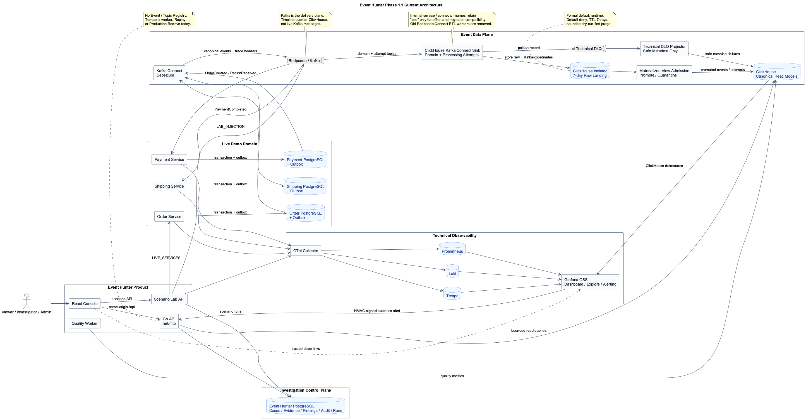
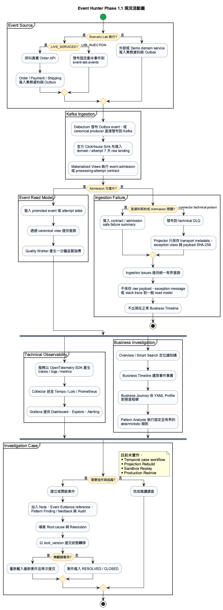

# Event Hunter

事件驅動架構治理與業務事故鑑識平台。

Event Hunter 是建立在 Grafana OSS、ClickHouse 與 Domain Events 之上的業務調查服務。它不重做
Grafana 的 Logs／Metrics／Traces 查詢與 Alerting，而是回答：

> 某筆業務為什麼失敗？經過哪些服務？是否違反業務規則？修正版是否真的改善？

實作前先讀 [project-scope.yaml](project-scope.yaml)。Agent 與開發者的契約優先順序為：

1. [project-scope.yaml](project-scope.yaml) 與 [requirements/traceability.yaml](requirements/traceability.yaml)
2. [openapi.yaml](openapi.yaml)、[contracts/asyncapi.yaml](contracts/asyncapi.yaml) 與 JSON Schema
3. [`backend/migrations`](backend/migrations) 與 [`e2e`](e2e)
4. 本 README、設計說明與 UI prototype

若文件衝突，以較高順位且可機器驗證的契約為準。
`REQ-EH-*` 與 `EH-MVP-*` 的用途請見 [requirements/README.md](requirements/README.md)。

目前可執行系統的元件、資料流、Scenario Lab 與使用者調查流程，集中記錄在
[Current Architecture](requirements/current-architecture.md)。該文件只描述 repository 與 Compose 中
已存在的 Phase 1.1 runtime；Phase 2／3 構想不混入現況圖。

## 1. 定位

目前 Phase 1.1 已具備以下業務調查入口：

- Overview／Smart Search：先以 Correlation、Trace、Event 或 Aggregate ID 定位。
- Business Timeline：查詢 ClickHouse 中的 canonical events 與 processing attempts。
- Business Journey：依已編譯的 YAML Journey Profile 解讀同一業務流程的里程碑。
- Ingestion Issues：集中查詢 contract validation、admission quarantine 與 connector technical DLQ 的安全摘要。
- Query Shortcuts：在 Timeline 內儲存、套用及管理有界查詢。
- Investigation Cases：協作、狀態轉移、Note、Evidence reference、Pattern Finding 與 Audit。
- Pattern Library／Analysis：執行固定、可測試、唯讀且 deterministic 的 Domain Pattern。
- Scenario Lab：執行 S1～S14 固定劇本，以後端實際結果判斷 PASS／FAIL。
- Feature Guide：說明調查路徑、外部系統接入與操作 runbook。

Supporting capabilities 包含三個 Go 示範服務的 Outbox-to-Timeline 管線、一分鐘確定性品質聚合、
Grafana Dashboard／Alerting、HMAC 驗證的 Grafana 業務告警接收 endpoint，以及 live OpenTelemetry
trace／log／metric 串接。

Grafana OSS 優先處理技術觀測、Dashboard、Explore、Correlations、Alerting、通知與基本快照；
Event Hunter 只接收需要業務調查的告警或人工查詢。事件 Replay 與版本修正驗證屬於第二階段，
不是 MVP 的必要功能。

```text
OpenTelemetry → Tempo / Loki / Prometheus → Grafana OSS
    → 技術觀測、Dashboard、Explore、Correlations、Alerting

Event Hunter
    → 業務時間線、Domain Pattern、調查案件與 Evidence Bundle
```

## 2. 目前架構

```text
Order / Payment / Shipping
  → PostgreSQL Outbox → Debezium → Redpanda / Kafka
  → ClickHouse Kafka Connect Sink → raw landing
  → ClickHouse Materialized Views admission + mapping → canonical read models
  → Event Hunter API → React Console

Domain services / Scenario Lab
  → OpenTelemetry Collector → Tempo / Loki / Prometheus → Grafana

Grafana Alerting → HMAC-signed webhook → Event Hunter Investigation Case
```

ClickHouse-first ingestion 已於 2026-08-27 正式採用。官方 ClickHouse Kafka Connect Sink 以獨立
consumer offsets 將 domain events 與 processing attempts 先存入 7 天 raw landing，再由 Admission
Contract 與 Materialized Views 分流為 `SEARCHABLE`、`SEARCHABLE_WITH_WARNINGS` 或 `QUARANTINED`。
未知 event type/version 仍可調查，不會被誤稱為完整業務契約已驗證。原始 POC 的內部 service、table
與 connector 名稱暫時保留以相容既有 offsets／資料；決策與驗證歷程見
[ClickHouse-first ingestion](requirements/clickhouse-mv-ingestion-poc.md)。
Business Timeline API 與事件詳細資訊已公開 `admission_status`、`quality_flags`、`admission_profile`；
有 warning 的可搜尋事件會在列表明確顯示「可查詢・需注意」，而不是冒充完整契約已通過。

所有 runtime readers 讀取穩定的 `canonical_forensics_events` 與
`canonical_event_processing_attempts` Views；repo committed default 與 API readiness 都是
`clickhouse-mv`。舊 Redpanda Connect domain／attempt workers 與設定已移除；下列命令可檢查或修復
既有資料庫的 canonical view：

```bash
bash scripts/reconcile-ingestion-mode.sh --mode status
bash scripts/reconcile-processing-attempt-ingestion-mode.sh --mode status
bash scripts/reconcile-ingestion-mode.sh --mode clickhouse-mv
bash scripts/reconcile-processing-attempt-ingestion-mode.sh --mode clickhouse-mv
```

API readiness 會驗證兩個 ClickHouse Sink connector tasks 與 technical DLQ projector。
`/ingestion-issues` 提供不含 raw payload、exception message 或 stack trace 的統一安全查詢；technical DLQ
由獨立 projector 保存 transport metadata；正式路線已驗證 ClickHouse outage、connector/projector restart
與 domain／attempt backlog drain；raw landing 維持 7 天 TTL、
default deny，人工清除只能使用最長 24 小時且距今至少 1 小時的 dry-run-first purge。大量 ingestion、
長時間 soak、capacity 與 throughput benchmark仍屬後續非功能驗收，不阻擋目前功能採用。

完整架構圖、live event sequence、ingestion、Scenario Lab、使用者活動與 backend dependency 圖見
[Current Architecture](requirements/current-architecture.md)。Kafka 是事件傳遞層；Business Timeline
不直接讀 Kafka，而是查詢 ClickHouse 保存的 read model。Event Hunter PostgreSQL 則保存案件、
Evidence reference、Finding、Audit、Saved Search 與 Scenario run。



PlantUML 原始檔：[event-hunter-architecture.puml](event-hunter-architecture.puml)

三個 Demo domain services 已使用 OpenTelemetry Go SDK 將 HTTP／業務處理 span、結構化 log 與
runtime metrics 經 OTLP 送至 Collector。franz-go `kotel` hooks 會在 Kafka producer／consumer
邊界注入與擷取 W3C Trace Context；outbox 同時持久化 `traceparent`／`tracestate`，Debezium 再將它們
放入 Kafka headers。因此 Order → Payment → Shipping 是同一條分散式 trace，不是以相同字串拼出的
三條獨立 trace。

### OpenTelemetry instrumentation profiles

- **Live SDK telemetry（正式本機 runtime）**：目前 Docker build 使用明確的 OTel SDK、OTLP HTTP
  trace／log／metric exporters、`otelhttp`、`otelslog` 與 franz-go `kotel`。這是 Phase 1 唯一會作為
  真實服務證據的 profile。
- **Synthetic fixture telemetry（測試）**：`scripts/load-observability-fixtures.py` 產生可重播 OTLP
  traces／logs，使用 `service.namespace=event-hunter.synthetic`、依 correlation 固定且可重播的 fixture instance 及
  `telemetry.source=synthetic-fixture` 與 live streams 隔離。它只用於固定時間的 UI／E2E 展示。
  Loader 會等待 Collector／Loki flush 並逐筆驗證；必要時可用
  `OBSERVABILITY_FIXTURE_FLUSH_WAIT_SECONDS` 調整本機等待秒數。
- **Optional `otelc` zero-code profile（後續、未啟用）**：OpenTelemetry Go compile-time
  instrumentation 自 v1.0.0 起標示為 stable，可作為獨立 build profile 評估；目前正式 Dockerfile、
  Compose 與 CI 都不使用它。官方支援清單目前包含 `net/http`、`database/sql`、`log/slog` 與
  `segmentio/kafka-go`，未列 franz-go，因此 Kafka 仍須保留 `kotel`。

未來若建立 `otelc` profile，禁止同時在同一 surface 啟用重複 instrumentation：`net/http` server
只能選 `otelc` 或 `otelhttp`，`database/sql` 只能選 `otelc` 或顯式 DB instrumentation。現行正式
profile 保持顯式 SDK 整合，不由 `otelc` 取代。參考
[OpenTelemetry compile-time instrumentation](https://opentelemetry.io/docs/zero-code/go/compile-time/)
與[官方 supported libraries](https://github.com/open-telemetry/opentelemetry-go-compile-instrumentation/blob/main/docs/getting-started.md#supported-libraries)。

| 元件 | 職責 |
|---|---|
| Kafka | 高吞吐 Domain Event 傳遞與保留 |
| Debezium | 依 [outbox-routing.yaml](contracts/platform/outbox-routing.yaml) 從 Outbox CDC 發布事件到 Kafka；不是發布兩次 |
| ClickHouse Kafka Connect Sink | 將 Domain Event 與 processing attempt 原始 Kafka record 保存到 raw landing；寫入成功後才提交 offset |
| ClickHouse Materialized Views | 執行 minimum envelope、known-event required keys、型別／enum／trace／時間檢查，分流 searchable／warning／quarantine |
| Technical DLQ Projector | 讀取官方 Sink technical DLQ，僅保存 topic/partition/offset、錯誤類別與 payload SHA-256 安全摘要 |
| PostgreSQL | MVP 案件、Pattern findings、Evidence reference 與稽核；未來才加入治理設定 |
| ClickHouse | 事件儲存、業務時間線、品質分析與高吞吐查詢 |
| OpenTelemetry / Grafana OSS | 技術觀測、Dashboard、Explore、Correlations、Alerting 與 Trace／Log 查看 |
| Grafana Alerting | 技術品質告警、ClickHouse SQL 告警、分組、路由與簽署 Webhook |
| Quality Worker | 每分鐘從 ClickHouse 與 Redpanda metrics 產生 `event_quality_metrics`；不使用 Temporal |
| Scenario Lab | 固定 S1～S14 劇本；S1／S12～S14 走真實三服務，S2～S11 走隔離 topic，PASS／FAIL 由實際資料回查 |
| Pattern Engine | 依固定 Domain 規則收集證據、比對 Domain Invariant 與產生 Finding |
| Temporal（未接入） | Compose 有選用容器 profile，但目前沒有 Event Hunter Workflow／Worker；不屬於 Phase 1.1 runtime |

### 本機開發環境

基礎設施已定義在 [compose.yaml](compose.yaml)，詳細 port、migration、資料重置與目前刻意未加入的
服務見 [infra/README.md](infra/README.md)。預設會啟動 PostgreSQL、ClickHouse、Redpanda、
Redpanda Console、OTel Collector、Prometheus、Loki、Tempo 與 Grafana；Temporal 必須明確選用：

```bash
bash scripts/dev-up.sh             # 預設 stack，不含 Temporal
bash scripts/dev-up.sh --temporal  # 需要 Workflow 開發時才加入 Temporal
bash scripts/dev-down.sh           # 停止容器，保留資料 volume
bash scripts/clickhouse-mv-poc-up.sh  # 相容名稱：啟動／修復正式 ClickHouse-first ingestion
bash scripts/test-clickhouse-mv-functional-recovery.sh # domain＋attempt 故障／恢復驗收
bash scripts/test-clickhouse-mv-candidate-only-recovery.sh # 同一正式驗收的明確入口
bash scripts/test-clickhouse-mv-raw-purge.sh           # 有界 raw purge 驗收
bash scripts/load-clickhouse-mv-candidate-fixtures.sh  # 相容入口：依正式 mapping 載入固定 synthetic fixtures
```

ClickHouse-first 仍使用 Redpanda 作為 Kafka-compatible broker；被移除的是 Redpanda Connect ETL
workers，不是 broker。Debezium Kafka Connect 負責 Outbox CDC，ClickHouse Kafka Connect Sink 則負責
domain events 與 processing attempts 的 raw transport，兩者職責不同。

本機對外 port 統一由 [port-registry.yaml](contracts/platform/port-registry.yaml) 分配，從目前第一個
可用的 `28313` 開始，依資料庫／Broker、ingestion／observability、應用服務、選用 Workflow 排序。
較底層的依賴一律取得較小編號；`28310`～`28312` 因其他本機服務已使用而排除。Compose 內部仍
保留 upstream 標準 port。

## 3. 為什麼事件資料直接使用 ClickHouse

Event Hunter 將 PostgreSQL 與 ClickHouse 分工，而不是把所有資料塞進同一個資料庫：

```text
PostgreSQL
└── 控制面：平台設定、案件、權限、Schema、稽核；可變資料使用樂觀鎖

ClickHouse
└── 資料面：forensics_events、event_quality_metrics、Timeline aggregates
```

ClickHouse 適合 Event Hunter 的事件資料，因為事件主要是 append-only，且查詢集中在時間範圍、correlationId、aggregateId、服務與版本等分析條件。使用 `MergeTree`、合適的 `ORDER BY`、TTL 與 Materialized View，可以支援高吞吐寫入、長期保留和聚合查詢。

ClickHouse 不是案件與權限的交易資料庫；需要交易、Foreign Key、頻繁更新的資料仍放在 PostgreSQL。PostgreSQL 的可變資料必須使用樂觀鎖，避免多個調查員、Pattern Engine 或 Workflow 互相覆蓋更新。應用程式不要同步寫入兩個分析資料庫，而是由 Kafka 以獨立 Sink 將事件送入 ClickHouse。

## 4. MVP 功能

### 功能分工與暫緩項目

| 原本功能 | 優先處理者 | Event Hunter 第一版 | 暫先不做 |
|---|---|---|---|
| Logs／Metrics／Traces 查詢、Dashboard、Explore、Correlations | Grafana OSS | 不重做，提供 Deep Link | Event Hunter 自建 Observability UI |
| 技術品質告警、分組、路由、通知 | Grafana Alerting | 接收選定的業務調查 Webhook | 通用 Alert Management、On-call、Escalation |
| Event Catalog／Schema Governance | Schema Registry／Kafka tooling | 不提供控制面 API | Event Catalog UI 與治理 CRUD |
| Topic Registry／Consumer 管理 | Kafka Admin UI／Redpanda Console | 不提供控制面 API | Topic Registry UI 與治理 CRUD |
| Runtime Quality Dashboard | ClickHouse + Grafana | 只讀取需要調查的品質結果 | Event Hunter 自建 Quality Console |
| Business Timeline | Event Hunter + ClickHouse + Grafana links | 開發 | — |
| Investigation Case | Event Hunter + PostgreSQL | 開發 | — |
| Domain Pattern Engine | Event Hunter | 開發固定、可測試、唯讀規則 | LLM／AI 自動推理 |
| Evidence Bundle | Event Hunter manifest + Grafana references | 開發 | 複製全部 Logs／Metrics／Trace 原始資料 |
| Projection Rebuild／Sandbox Replay | Temporal + Sandbox | Phase 2／3 | MVP Replay、Production Redrive |
| 業務版本修正驗證 | Event Hunter + Temporal | Phase 2／3 | MVP 自動版本比較 |

Event Hunter 的 API 與資料表仍可保留未來治理與 Replay 的設計草案。第一版的核心 UI 承諾
Business Timeline、Investigation Case、Domain Pattern 與 Evidence Bundle；Outbox-to-Timeline、
品質聚合／Grafana assets 與簽署告警接入則是必要 supporting capabilities。Grafana OSS 是技術
觀測與告警的主要入口；Event Hunter API 不作為 Kafka ingestion endpoint，也不重新打造 Grafana Console。

### Event Catalog

未來治理方向。MVP 使用既有 Schema Registry／事件契約檔案，不開發 Event Catalog 控制面 API。
原本的 Event type、Schema version、Producer、Consumer、Owner、Compatibility policy 與 Lifecycle
status 欄位先保留在設計文件，待後續確認治理邊界再實作。

### Topic Registry

未來治理方向。MVP 使用 Kafka Admin UI／Redpanda Console 或既有平台管理 Topic、Partition key、
Ordering guarantee、Retention、PII classification、Owner 與 Consumer groups；Event Hunter 暫不
提供相同的 CRUD UI。

### Runtime Quality

由 Quality Worker、ClickHouse 與 Grafana Dashboard／Alerting 處理 Consumer lag、Duplicate rate、
Event delay、Schema violation、Out-of-order candidate 與 DLQ count。Event Hunter 只提供這個固定
一分鐘聚合工作、接收需要業務調查的簽署告警，或在 Pattern 查詢時讀取品質結果；不另做通用
Quality Console。

冪等性是防止重複造成錯誤；Duplicate detection 是觀察上游或基礎設施是否惡化。重複或亂序不一定是事故，必須搭配 Domain Invariant 判斷。

`event_quality_metrics` 是上述 Grafana 查詢使用的 ClickHouse 預聚合表。每列代表一段明確時間窗、
Topic partition 與 Consumer Group 的品質統計，可保存事件數、重複數、Schema 違規、亂序候選、
DLQ、事件進站延遲、Consumer lag 與處理耗時。它不是 ClickHouse 自動統計，也不是 Event Hunter 的
CRUD 資料；Compose 的 `quality-worker schedule` 依 [event-quality-rules.yaml](contracts/quality/event-quality-rules.yaml)
每分鐘寫入，並等待 2 分鐘 late-arrival grace。單一窗口補算使用 `quality-worker aggregate --from ... --to ...`；
多窗口補算使用 `quality-worker backfill --from ... --to ... --window 1m`。補算會追加 revision，Grafana
以每個窗口／維度最新的 `calculated_at` 顯示與告警。本機 `scripts/load-demo-fixtures.sh` 會一起載入
Domain Event、synthetic/replayable OTLP trace／log 與事件時間品質窗口，確保 Timeline deep links
可直接看到固定示範資料；它不是正式服務 telemetry 的替代品。`scripts/test-live-observability.sh` 會
建立真實訂單，驗證 ClickHouse、Tempo 與 Loki 使用同一 trace ID、三服務 log 具備 canonical
event／Kafka attributes，完整模式並會在重啟 observability backends 後再次查詢同一筆 telemetry。

互動 fixture 目前包含 38 筆 Domain Events；除正常付款出貨與 Pattern exclusion 外，也涵蓋付款
拒絕後取消、完整配送、派車失敗重試，以及退貨入庫後退款。每個擴充情境都有固定 correlation
ID、同一 trace ID、跨 Aggregate causation chain 與對應 Karate E2E。目前由 deterministic fixture
loaders 發送至本機 persistence／OTLP，並以 `event-hunter.synthetic` namespace 和 live telemetry 隔離。

### Scenario Lab

`/scenario-lab` 提供固定 S1～S14 劇本，但執行結果不是 mock：

- S1、S12、S13、S14 `LIVE_SERVICES` 呼叫真實 Order API，經 transactional outbox、Debezium、Kafka、Payment、Shipping 與 ClickHouse。
- S2～S11 `LAB_INJECTION` 發送到隔離的 `event-lab.events`，避免正式 demo consumers 改寫刻意設計的重複、亂序、schema violation、retry／DLQ、配送與退貨序列。
- 每次 run 先保存於 PostgreSQL `scenario_runs`；後端再從 ClickHouse `forensics_events`、`event_processing_attempts` 與 `event_ingestion_failures` 回查 actual，逐項計算 checks 與 `PASSED`／`FAILED`／`TIMED_OUT`。
- Scenario Lab 使用真實 OTel business span、franz-go `kotel` 與 `otelslog`；event envelope、Kafka `traceparent`、Tempo trace 與 Loki log 共用 trace ID。fixture telemetry 與 Scenario Lab live execution 是不同來源。
- Prometheus 可查詢 `event_lab_scenario_runs_total`、`event_lab_events_emitted_total`、`event_lab_processing_retries_total`、`event_lab_dlq_total` 與 `event_lab_scenario_duration_seconds`。
- Grafana／Tempo／Loki links 使用已 provisioned datasource UID 與 Grafana Explore `panes` 格式，不以看似可點但無查詢內容的 query string 冒充 deep link。

三個 demo services 因此仍是 S1 與 live observability 的必要系統；Scenario Lab 是控制與驗證入口，不是它們的替代品。

### Event Hunter Guide

`/guide` 位於側欄 Scenario Lab 下方，預設開啟 `Getting Started & Integration`。它先說明
Overview／Smart Search → Timeline → Journey／Pattern → Investigation Case → Query Shortcut 的完整調查路徑，
再以「先回答三個問題」的 5 分鐘入口判斷：來源是否 canonical、只需 Timeline 或也需技術／領域判讀、
以及沿用既有 topic／event type 或必須新增契約。頁面接著用 `PaymentCompleted` 從來源系統、Adapter、
Kafka、ClickHouse Sink、raw landing、Materialized Views 到 Timeline 的單筆事件範例，並依四種來源情況直接列出是否需要
Adapter、要改哪些設定與第一個成功證據。Kafka 名詞可由折疊式白話字典查閱；Timeline no data 也有固定
五步排查順序。

完成快速判斷後，再選擇外部系統接入的深度：

- **Minimum**：發布符合 Canonical Event Envelope 的事件到已核准 Kafka topic，並配置 schema 與
  ingestion mapping；可使用 Timeline、基本搜尋與手動建案。
- **Recommended**：再提供 processing attempt 與 OpenTelemetry trace／log；可判讀 retry／DLQ，並由
  Event Hunter deep link 開啟 Tempo／Loki。
- **Full**：再加入 Journey profile、deterministic Pattern 與 Grafana signed alert webhook；可使用
  Journey／Pattern Analysis，符合資格的 firing alert 也能自動建案。

現行正式事件入口是 Kafka pipeline，不是 Event Hunter HTTP API，也不直接輪詢 production database。
既有服務可使用 Outbox → Debezium → Kafka；來源 event 若不是 canonical，應以擁有獨立 consumer group 的
Normalization Adapter 轉換後再發布到核准 canonical topic。這類 Adapter 是 consumer + producer
事件處理器，不是 ClickHouse Sink，也不會搶走其他 consumer group 的訊息。目前尚未提供輸入 topic／schema
後自動完成 ACL、mapping、Journey 或 Pattern 的 self-service onboarding UI；相關變更仍必須更新
[`contracts/asyncapi.yaml`](contracts/asyncapi.yaml)、
[`canonical-envelope.schema.json`](contracts/events/canonical-envelope.schema.json)、
[`ingestion-mapping.yaml`](contracts/platform/ingestion-mapping.yaml) 與對應 E2E。

同一頁的進階 Integration Runbook 提供：Kafka／ClickHouse／PostgreSQL／observability backends 的
資料責任、事件進入 Timeline 前的五個 admission gates、從 scope 到 release 的七個可展開步驟、每步的
repo source of truth／驗證／完成條件，以及 ingestion contract error、Consumer 技術失敗、合法業務失敗、
格式正確但語意錯誤四種診斷路徑。頁面只列可重跑的 SAFE／CONTROLLED 驗證命令；完整啟停、備份、
restore、retention 與 secret rotation 仍以
[`operations-runbook.md`](requirements/operations-runbook.md) 為準。

本機啟停、readiness、故障恢復、cold backup／restore、retention 與 secret rotation 的操作程序見
[`requirements/operations-runbook.md`](requirements/operations-runbook.md)，日常唯讀檢查可執行
`bash scripts/verify-operations-runbook.sh`。

### Business Timeline

輸入 correlationId、orderId 或 paymentId，從 ClickHouse 顯示 Domain Events、Event time、processing
time、Kafka offset、traceId、服務版本與遮罩後 payload，並提供 Grafana／Tempo／Loki deep link。
Grafana 仍是 Logs、Metrics、Traces 的原始觀測介面；Event Hunter 只組合業務事件與來源參照。

時間線搜尋 UI 分成基本與進階條件：

- 基本：`correlationId`、`aggregateId`／Business ID、`traceId`、`eventId` 四種查詢鍵，以及有界的 `from`／`to` 時間範圍。
- 進階：`event_type`／`event_version`、Producer／Service、`causation_id`、Kafka topic、partition／offset、Pattern ID、Grafana Alert ID、最低 severity 與是否包含遮罩後 payload。
- `correlationId` 主要走 Business Timeline 查詢；其他識別碼與進階條件走 allowlist event search，再由 Query Service 組合成時間線。
- 所有條件都必須對應 allowlist Query Port；不接受任意 SQL、任意排序或無時間範圍的 ClickHouse 查詢。

### Business Journey

`/journey` 是 Phase 1.1 的 Order／Journey-centric 唯讀入口。它呼叫單一 bounded API
`GET /api/v1/business-journeys/{correlationId}`，由後端將既有 canonical events 組織為
Order、Payment、Shipping、Delivery、Return milestones，並回傳 expected/actual、跨里程碑耗時、
整體狀態與確定性缺漏提示。

- 第一版是固定物流 Order profile，不在前端或 runtime 自訂其他領域的 milestone 語意。
- 固定 profile 的 authoring source 已改為 Git-managed
  [`contracts/journeys/order-fulfillment.yaml`](contracts/journeys/order-fulfillment.yaml)；milestone、狀態與
  缺漏規則不再寫死於 Go。API 與畫面會顯示實際採用的 profile ID／version。
- `/journey-profiles` 先以列表比較 ID、版本、狀態、Default、里程碑數、規則數與 YAML 來源；點選一列後
  才在右側詳細抽屜顯示完整定義。選取值保存在 `?profile={id}@v{version}`，可重新整理與分享。
- 目前仍只有一份 `active + default` profile；新增第二領域前要先定義 profile selection contract，系統不靠
  correlation ID 猜測領域，也不提供 runtime 規則編輯。
- `ShipmentDelivered` 是完整完成條件；只有 `ShipmentCreated` 時仍顯示 `IN_PROGRESS`。
- Journey 狀態依同一 correlation 的完整事件集合推導，但每張里程碑卡片只列自己
  `expected_event_types` 的 actual events。因此 `ShipmentCreated` 可讓 Delivery 進入 `IN_PROGRESS`，
  同時 Delivery 仍在等待自己的 `ShipmentDelivered`；Return 沒有 `ReturnRequested` 時則是尚未觸發的
  `NOT_APPLICABLE`，不是事件遺失。
- 付款完成超過五分鐘仍缺少 `ShipmentCreated` 時，回傳 `MISSING_SHIPMENT_AFTER_PAYMENT`。
- `EMPTY` 與 ClickHouse `503/504` 分開呈現，不把來源失效當成真的沒有事件。
- 每個實際事件可帶著原查詢時間窗回到 Timeline event detail。
- 此功能不建立 projection、不重送事件，也不修改 production system。

### Saved Searches／查詢捷徑

Saved Searches 是 Timeline 與 Business Journey 內的共用「查詢捷徑」抽屜，不再占用一個頂層功能頁。
使用者取得結果後可將目前 bounded query 命名保存；後端只接受 typed allowlist query state，並自行重建
`/timeline` 或 `/journey` 的 `open_url`。舊 `/saved-searches` 路徑會相容導向
`/timeline?panel=query-shortcuts`。

- 個人資料以已簽署 demo session 的 `subject` 隔離；不同 principal 不可列出或刪除他人的搜尋。
- Viewer 可管理自己的 Saved Search，但仍不能建立或修改 Investigation Case。
- `include_payload`、任意 URL、SQL、排序與超過七天的時間窗都不會寫入。
- PostgreSQL `saved_searches` 保存名稱、target 與 JSONB query state；同一 owner 的名稱不分大小寫唯一。
- 內建「最近付款失敗、派送失敗、取消訂單、付款退款」由後端版本化並以相對 72 小時產生，前端唯讀。
- 個人搜尋可選 `ABSOLUTE` 固定時間，或 `RELATIVE` 的最近 1 小時、24 小時、72 小時、7 天；相對模式每次由後端重算 URL，避免固定日期過期。

### Investigation Case

```text
OPEN ──開始調查──> INVESTIGATING ──送交審核──> WAITING_APPROVAL
                         │                  │
                         └──標記已解決 <────┘
                                  │
                              RESOLVED ──重新開啟──> INVESTIGATING

OPEN／INVESTIGATING／WAITING_APPROVAL／RESOLVED ──結案──> CLOSED
```

案件保存標題、嚴重度、correlationId、相關事件、Trace、Pattern findings、證據、人工筆記、根因與修復版本；只有啟用選用流程時才保存 Temporal Workflow ID。

案件 Aggregate 是狀態規則的唯一來源，API 會在每筆案件回傳 `allowed_transitions`。前端依這個集合顯示
開始調查、送交審核、返回調查、標記已解決、重新開啟與結案，不自行推測下一個狀態。Resolve 與 Close
都必須在專用表單留下 Root cause 與 Resolution summary；未送出的草稿在離開或重新整理前會提示，
optimistic-lock conflict 則重新載入最新案件，避免覆蓋另一位調查者的修改。完整規則見
[`contracts/platform/investigation-state-machine.yaml`](contracts/platform/investigation-state-machine.yaml)。

Grafana signed webhook 的 firing／resolved receipt 會成為案件 `GRAFANA_ALERT` Evidence；重送通知不會重複寫入。前端只接受 API 驗證過的 Alerting 相對路徑，並重新套用設定中的可信 Grafana origin，不直接開啟 webhook 提供的任意 URL。

Phase 1 原始驗收範圍是 signed webhook intake contract；Phase 1.1 後續已補上真實 Grafana delivery：
專用 HMAC Contact Point、只匹配 `event_hunter=investigate` 的 Notification Policy，以及從
`event_processing_attempts` 為每個 terminal DLQ correlation 產生 alert instance 的 business rule。
Firing 會建立／連結案件，resolved 只追加 Evidence、不自動結案。原有六條沒有單一
`correlation_id` 的 aggregate quality alerts 仍留在 Grafana，不會使用假的平台 correlation 建案。
完整資格與邊界列於
[`requirements/phase-1-1-development-plan.md`](requirements/phase-1-1-development-plan.md) 的 P1.1-06。

### Investigation Pattern Engine

第一版只實作 [payment-completed-without-shipment.yaml](contracts/patterns/payment-completed-without-shipment.yaml)
定義的固定規則；`contracts/patterns/*.yaml` 是唯一 authoring source，generator 會產生不可變的 Go
runtime registry，契約驗證會阻擋 YAML 與 generated code 漂移，不提供線上規則編輯。分析器依事件
`occurred_at` 套用 trigger-relative PT5M window、maturity 與 exclusion 語意；技術
Logs／Trace／Metrics 由 Grafana deep link 提供，Pattern Engine 不複製技術觀測資料。

輸出必須包含 `pattern_id`、`matched_conditions`、`severity`、`evidence_references`、
`recommended_next_query` 與固定 `query_template_id`。Pattern Engine 不接受任意 SQL，也不直接修改
正式訂單、付款、庫存或環境設定。

修改 Pattern YAML 後執行：

```bash
python3 scripts/generate-pattern-registry.py
python3 scripts/generate-pattern-registry.py --check
```

`scripts/validate-contracts.py` 已包含同一項 drift check。Pattern Library 支援
`/patterns?pattern_id=<id>#pattern-<id>`，可由 Evidence 直接定位並醒目顯示對應規則。

修改 Business Journey YAML 後執行：

```bash
python3 scripts/generate-journey-registry.py
python3 scripts/generate-journey-registry.py --check
```

完整規則語意與治理邊界見
[`requirements/business-journey-profile-contract.md`](requirements/business-journey-profile-contract.md)。

## 5. Temporal 使用情境（尚未接入）

Compose 目前只有選用的 Temporal server／UI profile，Event Hunter 尚無 Workflow／Worker／Activity
實作。Business Timeline、同步 Pattern、Journey、案件與 Evidence Bundle 均獨立運作。以下內容是
Phase 2／3 若核准後的設計原則，不是目前可操作功能。

### 重試邊界

Event Hunter 必須區分不同層次的重試，不能把所有重試都歸因於 Temporal：

1. **Kafka Consumer 事件重試**：由 Consumer Framework、Retry Topic 或 DLQ 處理；Event Hunter 只讀取來源提供的 attempt、狀態與錯誤資訊。
2. **HTTP／服務呼叫重試**：由客戶端、Gateway 或服務本身處理；Event Hunter 透過 OpenTelemetry Trace／Log 參照呈現。
3. **未來調查流程重試**：若 Phase 2／3 接入 Temporal，查詢 ClickHouse、Grafana 或產生大型報告等外部操作才由 Activity Retry Policy 處理。

`forensics_events` 的事件紀錄本身不能推導 Consumer 重試次數；同一事件可能被不同 Consumer Group 各自重試。

```text
Grafana Alerting Webhook 或營運人員建立案件
→ Event Hunter 驗證 correlationId／案件範圍
→ 收集事件與 Trace
→ Pattern Engine 產生初步分析
→ 產生證據與調查報告
→ （Phase 2／3）等待工程師核准 Rebuild 或 Replay
→ （Phase 2／3）執行隔離分析
→ （Phase 2／3）比較結果
→ 產生報告
→ 關閉案件
```

適合的原因：流程可能跨數小時或數天，需要人工 Signal、外部 Sandbox Retry、Worker 重啟後恢復，以及完成後的清理與通知。

不適合用 Temporal 處理 Kafka routing、ClickHouse aggregation、每筆事件啟動 Workflow、每秒大量 Telemetry 或毫秒級控制。
Grafana Alerting 的分組、路由、通知與 On-call 也不由 Temporal 或 Event Hunter 重做。

## 6. Timeline Reconstruction 與後續 Replay

### MVP：Timeline Reconstruction

從 ClickHouse 的原始事件依 `correlation_id`、`aggregate_id`、`occurred_at` 重建業務時間線，只用於調查理解與證據呈現，不執行業務副作用。

### Phase 2：Projection Rebuild

將歷史事件送入隔離的 read model，驗證投影能否正確重建，並比較現有 Projection 與重建結果。必要時產生修復資料，但不直接寫入正式業務資料庫。

### Phase 3：Sandbox Behavioral Replay

在 Testcontainers／Docker Sandbox 執行指定版本服務，並攔截 Payment gateway、Email/SMS、Shipping provider 和正式資料庫等副作用。

比較舊版／新版輸出事件、Database diff、External call diff 和 Domain Invariants：

```text
activeShipmentCount <= 1
capturedAmount <= authorizedAmount
refundedAmount <= capturedAmount
shippedQuantity <= reservedQuantity
```

### 不在本專案範圍：Production Redrive

Production Redrive 是將歷史事件重新送回正式事件流或正式 Consumer 的高風險運維操作，可能造成重複扣款、通知、出貨或退款。Event Hunter 不在 MVP 或一般 Replay API 中提供此功能；若未來需要，必須另設獨立權限、人工核准、目標 Consumer、速度限制、Idempotency 與 Kill Switch。

## 7. Canonical Event Envelope

接入事件應盡量標準化：

```json
{
  "eventId": "evt-001",
  "eventType": "PaymentCompleted",
  "eventVersion": 1,
  "occurredAt": "2026-08-19T10:00:00Z",
  "producer": "payment-service",
  "correlationId": "ORDER-1001",
  "causationId": "evt-000",
  "traceId": "trace-500",
  "aggregateType": "Payment",
  "aggregateId": "PAYMENT-1001",
  "sequence": 7,
  "payload": {}
}
```

必要欄位：

- eventId：重複偵測與冪等。
- correlationId：串起業務流程。
- causationId：追蹤因果來源。
- traceId：連接 OpenTelemetry。
- aggregateId：查詢同一業務聚合。
- sequence：協助判斷遺失與亂序。
- eventVersion：處理 Schema 演進。

## 8. API 契約

HTTP API 的唯一契約是 [openapi.yaml](openapi.yaml)。目前 Go API 使用標準庫 `net/http`／`ServeMux`
手寫薄 HTTP adapters；application service 與 domain model 不直接暴露給 transport。前端以
`openapi-typescript` 產生型別，再由 `openapi-fetch` 呼叫 API。

目前 runtime 不會由 Huma 動態產生 `/docs` 或 `/openapi.json`。契約漂移由
`python3 scripts/validate-contracts.py`、frontend `api:check`、Go tests 與 Karate acceptance tests
共同檢查；互動文件可依第 19 節用 Swagger UI 或 Redoc 讀取 committed `openapi.yaml`。

## 9. 資料模型

資料表、Context ownership、ClickHouse 排序鍵、PostgreSQL 樂觀鎖與 migration 原則集中在
[data-model.md](data-model.md)。多來源調查摘要的 Query Service、Read Model 與部分結果規則集中在
[investigation-summary.md](investigation-summary.md)。README 只保留架構與開發決策，避免資料模型分散在多份文件。

## 10. MVP 邊界

### 第一版完成

```text
3 個 Go 示範微服務：Order → Payment → Shipping
Kafka Domain Events
PostgreSQL Outbox + Debezium
Kafka ingestion
PostgreSQL control plane + ClickHouse event plane
OpenTelemetry + Grafana OSS／Tempo／Loki／Prometheus
Grafana Dashboard／Explore／Correlations／Alerting
Grafana Alerting Webhook → Event Hunter
Business Timeline
Investigation Case
Go Domain Pattern Engine 唯讀調查
Evidence Bundle manifest
Investigation Summary read model
Viewer／Investigator／Admin Demo Session（簽署 HttpOnly Cookie，無使用者資料表）
Scenario Lab S1～S14（live services 與隔離 injection）
Business Journey 與 Journey Profile Registry 唯讀列表
Query Shortcuts（Saved Searches 內嵌 Timeline）
```

### 第一版不做

- 任意資料庫 Connector 平台
- Event Catalog／Topic Registry 的 Event Hunter CRUD；先使用 Schema Registry／Kafka tooling
- Event Hunter 自建 Logs／Metrics／Traces、Dashboard、Explore 或 Kafka Explorer
- Event Hunter 自建通用 Runtime Quality Console、Alert dedup、On-call 與 Escalation
- Keep、Grafana Cloud IRM 或其他通用 Incident Management 的替代品
- 多租戶與完整 RBAC
- 帳號、密碼、使用者資料表與正式 OIDC 整合
- 自動修改正式環境
- 完整 Behavioral Replay
- Production Redrive／重新送回正式事件流
- 自建 Observability backend；使用 Grafana OSS 與既有 OTel backend
- 應用程式同步寫入多個分析資料庫
- 將每一筆事件都啟動 Temporal Workflow

## 11. 開發前準備清單

開工前先完成以下設計與環境準備；這些項目完成後，實作才不會在 API、事件契約、資料表與
測試環境之間反覆返工。

### 11.1 必須先定案的邊界

- [x] MVP 故事：`OrderCreated → PaymentCompleted → ShipmentCreated`，異常案例為付款完成後 5 分鐘仍未出貨。
- [x] MVP 不做：LLM、Production Redrive、多租戶、完整 RBAC、任意 Connector、完整 Sandbox Replay。
- [x] Grafana OSS 是 Logs／Metrics／Traces、Dashboard、Explore、Correlations 與 Alerting 的主要入口；Event Hunter 只負責業務調查層。
- [x] Event Catalog、Topic Registry、Runtime Quality Console、通用 On-call／Escalation明確列為「暫先不做」。
- [x] Grafana Alerting → Event Hunter 的 payload、HMAC、replay protection、去重鍵與建案資格已定義。
- [x] Temporal 為預設關閉的選用能力；Kafka Consumer 重試由 Consumer Framework／Retry Topic／DLQ 處理。
- [x] 定義每個 Bounded Context 的 owner、輸入、輸出與不可依賴的內部資料。
- [x] 成功標準已寫入 [`e2e`](e2e) Karate features。

### 11.2 必須先完成的契約

- [x] HTTP API 以 [openapi.yaml](openapi.yaml) 為唯一契約；包含 status code、錯誤格式、分頁與 `If-Match` 規則。
- [x] Kafka event contract 使用 [AsyncAPI](contracts/asyncapi.yaml) + JSON Schema 2020-12。
- [x] Grafana Alerting Webhook contract 使用 JSON Schema、OpenAPI 與 Karate；Event Hunter 不自行建立通用告警路由、通知或 On-call API。
- [x] Canonical event envelope 定義於 [JSON Schema](contracts/events/canonical-envelope.schema.json)。
- [x] Processing-attempt JSON Schema、Topic、ClickHouse mapping 與 fixture 已定義；沒有來源遙測時不可自行推斷重試。
- [x] Event versioning、Schema violation 與 DLQ 行為已定義於 `contracts/platform/event-versioning-policy.yaml`。
- [x] MVP `InvestigationCase` 合法轉移已定義；`ReplaySession` 留到 Phase 2／3 再鎖定。
- [x] Transport idempotency、business duplicate 與 out-of-order candidate 語意已定義。

### 11.3 資料與隱私

- [x] PostgreSQL／ClickHouse ownership 與欄位清單已定義。
- [x] 摘要資料來源、必要性、部分失敗與 Evidence reference 已定義。
- [x] PostgreSQL baseline 與 ClickHouse DDL 已建立於 [`backend/migrations`](backend/migrations)，由 repo scripts 冪等套用。
- [x] UTC、ID、`event_id`、`correlation_id`、`trace_id` 與 interval 語意已固定。
- [x] 事件欄位 PII classification、遮罩、保留與角色權限已定義。
- [x] Append-only、idempotency 與需要 `lock_version` 的資料表已列於資料模型。
- [x] 不含真實個資的 fixture 位於 [`contracts/fixtures`](contracts/fixtures)。

### 11.4 本機與部署環境

- [x] 準備 `compose.yaml` 本機核心依賴：Redpanda、PostgreSQL、ClickHouse、OTel Collector、Grafana、Tempo、Loki、Prometheus；Temporal 放在選用 profile。
- [x] 依已固定的 Outbox、Topic 與 ingestion mapping 契約加入 Debezium、ClickHouse Kafka Connect Sink 與 Materialized Views；包含 store-all raw、admission 分流、technical DLQ、安全 failure metadata 與 acknowledgement 驗證。
- [x] 固定各服務版本、port、health check、啟動順序與資料 volume；使用方式集中在 [`infra/README.md`](infra/README.md)。
- [x] 建立 `.env.example`，只放變數名稱與安全的本機預設值；正式 Secret 由 Secret Manager／Vault 注入。
- [x] 建立三個示範服務與 Outbox／Debezium 設定，確認事件經 Kafka pipeline 寫入 ClickHouse。
- [x] Migration、資料重置、ingestion mapping 與 fixture contract 已定義；domain／quality fixture loader 透過 `scripts/fixture_mapping.py` 直接解讀正式 ingestion mapping，不再維護重複的 ClickHouse 欄位表。

### 11.5 程式骨架與品質門檻

- [x] `backend/` 已建立 screaming-architecture application capabilities、rich domain、composition roots、platform adapters 與對應測試。
- [x] 本機 release scripts 已涵蓋 `go.mod`／`go.sum` 驗證、gofmt、go vet、go test、Frontend checks、
  Staticcheck、ESLint、govulncheck、pnpm audit 與完整 vertical slice；依本輪決策不要求 hosted CI，
  掃描報告寫入 `build/reports/security-quality-summary.json`。
- [x] API 已設定 request／PostgreSQL／ClickHouse timeout、每遠端位址 rate limit、ClickHouse 唯讀 query budget，並保存於 failure policy、Compose 與 `.env.example`。
- [x] ClickHouse Sink 已設定 retry／失敗不 ack、technical DLQ 與可重送去重驗證；Materialized Views 負責 deterministic admission。
- [ ] Temporal Workflow／Worker 尚未實作；屬 Phase 2／3 候選，不阻擋 Phase 1.1。
- [x] API Handler 不寫 SQL；Investigation 與 Grafana webhook 的 PostgreSQL 操作、Timeline／Investigation 的 ClickHouse 查詢均已移至 application service／repository 或 read-model adapter。Grafana webhook 的 HTTP adapter 只處理 raw-body HMAC、payload validation 與 response mapping，application service 決定資格／去重／disposition，PostgreSQL adapter 保證 advisory lock、receipt、案件與 Evidence 位於交易邊界內；Domain 不 import `net/http`／pgx／ClickHouse／OTel，Context 不引用其他 Context 的 persistence model。
- [x] Investigation 案件的 PostgreSQL 更新全部走 Repository 與 optimistic locking；禁止繞過版本欄位的 bulk update。

### 11.6 測試與可觀測性

- [x] Domain Unit Test：事件 envelope、案件狀態／invariants、Pattern／Journey 規則、duplicate／sequence 與 demo-service 行為。
- [x] Contract Test：OpenAPI schema、Kafka event schema、Outbox → Debezium → Kafka → ClickHouse 欄位映射。
- [ ] Integration Test：已有真實 PostgreSQL transaction rollback test 與完整 Compose E2E；獨立 PostgreSQL／ClickHouse Testcontainers suite 尚未建立，選用 Temporal 時才加入 Temporal testsuite。
- [x] E2E Test：建立訂單、故意漏掉出貨事件、建立案件、執行 Pattern、產生 Evidence Bundle、結案。
- [x] Demo service 的請求、outbox 與 Kafka processing 保留 `correlation_id`、`trace_id`、`event_id`；真實 telemetry 經 OTel Collector 送至 Tempo／Loki／Prometheus，並有最小可用 Grafana dashboard 與 live vertical-slice 驗證。
- [x] ClickHouse、Grafana／Tempo／Loki 與 Grafana Alerting Webhook 的 failure mode、重試、restart persistence 與 E2E cleanup 已驗證；Temporal 未啟用，待選用 adapter 啟動時另補 testsuite。

### 11.7 開發前的最小驗收條件

在開始大量功能開發前，至少要能完成：

```text
Order API 建立訂單
  → Outbox／Debezium／Kafka 發布事件
  → Kafka Sink 寫入 ClickHouse
  → 以 correlation_id 查到 Business Timeline
  → Pattern Engine 找出「付款成功但出貨事件缺失」
  → 建立 Investigation Case 與 Evidence
  → Grafana Dashboard／Alerting 可查詢品質並送出選定的業務告警
  → 同步 Pattern 分析與 Evidence manifest 可完成
  → 同時更新案件時，舊 lock_version 回傳 409 Conflict
```

以上流程通過後，才進入 Phase 1 的完整 API、Grafana Dashboard／Alerting 與 Domain Pattern；
不要先做漂亮的 Console 再補事件契約與可重現測試。

## 12. 開發階段

### Phase 1：監測、Pattern 與調查

建立三個示範微服務，發布 OrderCreated、PaymentCompleted、ShipmentCreated，加入 Outbox、correlationId 和 traceId，透過 Kafka Sink 寫入 ClickHouse；以 Grafana 完成品質 Dashboard／Alerting，再完成同步 Domain Pattern、Business Timeline、Investigation Case、Investigation Summary 與 Evidence Bundle。Temporal 不阻擋 Phase 1 完成；Event Catalog、Topic Registry 與 Event Hunter 自建 Quality Console 維持「暫先不做」。

Phase 1 的目前差距、原型 HTML 對照、Deep Link 最小規格與最終驗收 gate，統一記錄於
[Phase 1 交付與原型對照計畫](requirements/phase-1-delivery-plan.md)。`ui-prototype.html` 中的
Workflow／Replay 示意不得直接視為 Phase 1 必做功能。

### Phase 2：Projection Rebuild

加入隔離 Read Model、Projection Rebuild、現有狀態與重建狀態比較、Domain Invariant 驗證和重建報告；以 Temporal Activity 執行可重試的 Rebuild 工作。

### Phase 3：Sandbox Behavioral Replay

在 Testcontainers／Docker Sandbox 執行指定版本服務，攔截外部副作用，以 Temporal Workflow 管理核准、執行、比較與結案，比較輸出事件、Database diff、External call diff 和 Domain Invariants。

Production Redrive 不列入開發階段；它屬於另外的正式環境事故恢復產品，不是本專案的核心功能。

## 13. 面試時的核心說法

> Kafka 和 Debezium 負責可靠事件傳遞，ClickHouse 負責事件儲存、時間線與分析查詢，PostgreSQL 負責平台控制面，OpenTelemetry/Grafana OSS 負責 Logs／Metrics／Traces、Dashboard、Correlations 與 Alerting；Event Hunter 只把 Domain Event 與 Grafana／Trace 參照組合成業務時間線，Go Pattern Engine 做可重現的唯讀調查。若未來需要長時間重試與人工審批，可再評估 Temporal，但它不會進入高流量事件路徑。這樣不重做 Grafana 已經提供的通用 Observability 與 Incident Routing。

## 14. 活動圖

活動圖描述目前 Phase 1.1 的實際流程：事件來源、Kafka ingestion、ClickHouse read model、
OpenTelemetry／Grafana、Timeline／Journey／Pattern 與案件協作。Temporal、Projection Rebuild、
Sandbox Replay 與 Production Redrive 只列為未實作邊界，不畫成目前可執行流程。



- PlantUML 原始檔：[event-hunter-activity.puml](event-hunter-activity.puml)
- Mermaid 架構與活動圖：[Current Architecture](requirements/current-architecture.md)

## UI Prototype

第一版互動介面原型保存在 [ui-prototype.html](ui-prototype.html)，目前使用 mock data，
用來確認 MVP 的功能頁、列表、案件詳細頁、Modal、按鈕與主要調查流程。可直接用瀏覽器開啟；
它尚未連接 Go API，也不會修改 Kafka、ClickHouse 或正式業務資料。

若瀏覽器限制直接開啟本機 HTML，可在專案根目錄執行 `python3 -m http.server 28339`，再開啟
<http://localhost:28339/ui-prototype.html>。

MVP UI 只保留業務調查入口；Event Catalog、Topic Registry、Runtime Quality Console 與 Replay
不出現在主導覽。它們分別以 Schema Registry／Kafka tooling、Grafana Dashboard／Alerting 與
Temporal Sandbox 的外部整合或 Phase 2／3 文件表示，不在 Event Hunter 原型中重做。

| UI 類型 | MVP 原型內容 | 暫先不做／外部工具 |
|---|---|---|
| 功能頁 | 總覽、調查案件、業務時間線、Business Journey、Pattern Library（唯讀）、Scenario Lab；Saved Searches 內嵌為查詢捷徑抽屜 | Event Catalog、Topic Registry、Quality Console、Replay／Verify |
| 案件詳細頁 | 摘要、Timeline、Pattern Findings、Evidence Bundle | 選用 Temporal Workflow、Replay approval、Production Redrive |
| 主要列表 | 案件、Timeline events、Pattern findings、Evidence references、稽核紀錄 | Topic／Schema／Quality violation 管理列表 |
| 主要操作 | 建立案件、執行 Pattern、開啟 Grafana、查看 Evidence、結案 | Schema／Topic CRUD、通用 Alert routing、Replay 執行 |

PlantUML 原始檔：[event-hunter-activity.puml](event-hunter-activity.puml)

## 15. Frontend 技術棧

前端是與 Go API 分離的 React SPA，負責 Overview、Business Timeline、Business Journey、內嵌式
Query Shortcuts、Investigation Case、Pattern Analysis、Scenario Lab 與 Feature Guide；不重做 Grafana
的 Logs／Metrics／Traces Console。實際版本以 `frontend/package.json` 與 `pnpm-lock.yaml` 為準。

### 核心套件

```text
React 19 + TypeScript strict + Vite
├── React Router 7                     路由、layout、URL query state
├── TanStack Query                     server state、cache、retry、mutation
├── openapi-typescript + openapi-fetch committed contract types 與 API client
├── 專案 CSS                            UI styling 與 responsive layout
└── Vitest + React Testing Library     unit／component test
```

官方參考：[React TypeScript](https://react.dev/learn/typescript)、[Vite](https://vite.dev/guide/)、
[React Router](https://reactrouter.com/start/modes)、[TanStack Query](https://tanstack.dev/query/latest/docs/framework)、
[openapi-typescript](https://openapi-ts.dev/)。目前沒有安裝 Zod、React Hook Form、Tailwind、shadcn/ui、
TanStack Table、virtualizer、icon／toast library 或 MSW；若未來加入，必須先有實際需求與測試。

### 狀態與資料責任

```text
Server state       → TanStack Query
URL／搜尋條件       → React Router Search Params
Local UI state      → React useState／useReducer
複雜跨頁 UI state   → 只有實際需要時才評估 Zustand
```

React Router 與 TanStack Query 不應同時管理同一份 API 資料。Route loader 可以處理路由層級的
pending／error／auth 邊界，但實際案件、Timeline、Pattern 與 Evidence 查詢統一由 TanStack Query
負責，避免重複請求與 cache 不一致。

### API 與驗證

- `openapi.yaml` 是前端 API 型別的來源，不手寫重複的 request／response interface。
- 使用 `openapi-typescript` 產生 TypeScript types，`openapi-fetch` 統一 request 與錯誤轉換，再包裝成 TanStack Query hooks。
- URL 與表單輸入目前由頁面內的明確 parser／validation 處理；TypeScript compile-time type 不取代 runtime validation。
- API client 必須支援 `AbortSignal`、request ID、trace ID、Problem Details 錯誤格式與 `If-Match`。

### 前端維護原則

- 頁面目前仍集中於 `main.tsx`；後續拆分 route／feature module 時使用 lazy loading／code splitting。
- 對互不依賴的查詢平行發出 request，避免 waterfall；頁面離開或 query key 變更時取消過期請求。
- Timeline 使用 cursor pagination、bounded time range 與 query budget，不一次載入無界事件。
- Timeline 使用後端分頁與有界時間窗；若資料量證明需要，再評估 virtual scrolling。
- Derived state 在 render 計算，不用 `useEffect` 同步另一份 state；只對昂貴計算使用 memoization。
- 所有查詢條件可由 URL 重建；Loading、Empty、Error、Partial result 與 Retry 都要有明確 UI。
- 使用 route-level Error Boundary；不使用 `dangerouslySetInnerHTML` 顯示事件 payload。
- 直接 import 需要的模組，避免 barrel import 造成不必要的 bundle 載入。
- 不把 access token 放在 `localStorage`；優先使用 HttpOnly Secure cookie 或 OIDC／PKCE 流程。

### 前端測試分層

```text
Vitest + React Testing Library
└── components、hooks、form validation、state transition、route boundary

Karate e2e/frontend
└── 登入、Timeline 查詢、建立案件、執行 Pattern、查看 Evidence、結案
```

Karate UI 測試使用瀏覽器 driver；只有在跨瀏覽器互動或 component test 需求超出 Karate 範圍時，
才另外評估 Playwright，不在第一版同時維護兩套 UI E2E。

第一版不加入 Redux、Axios、GraphQL、Next.js、MSW 或自建 global event bus；server state、API client
與 URL query state 分別由上述工具負責。

## 16. Go 技術棧

本專案採用 Go 作為核心平台語言。Kafka、ClickHouse Kafka Connect Sink 與 ClickHouse Materialized Views 負責高吞吐事件資料路徑；
Go API、Scenario Lab、Quality Worker 與三個 Demo services 負責控制面、調查能力與 live vertical slice。
實際 toolchain 與依賴版本以 `backend/go.mod`、`backend/go.sum` 與
[toolchain-policy.yaml](contracts/platform/toolchain-policy.yaml) 為準。

```text
Go 1.26
├── net/http + ServeMux             HTTP server、middleware 與 transport adapters
├── database/sql + pgx stdlib       PostgreSQL repositories、transactions、optimistic lock
├── ClickHouse HTTP read models     有界事件、Timeline 與品質查詢
├── franz-go + kotel                Kafka producer／consumer 與 trace propagation
├── OpenTelemetry Go exporters      OTLP traces、logs、metrics
├── otelhttp + otelslog             HTTP spans 與 trace-correlated structured logs
└── testing + httptest              Domain、application、adapter 與 HTTP tests
```

### 套件清單

| 類別 | 套件／工具 | 用途 |
|---|---|---|
| HTTP | 標準庫 `net/http`、`http.ServeMux`、`httptest` | API、middleware、health、HTTP tests |
| PostgreSQL | `database/sql` + `github.com/jackc/pgx/v5/stdlib` | Repository、transaction、advisory lock、optimistic lock |
| ClickHouse | 標準 HTTP client read-model adapter | 參數化且有 query budget 的唯讀查詢；寫入由官方 Kafka Connect Sink 與 Materialized Views 處理 |
| Kafka | `github.com/twmb/franz-go` | Demo consumers、Scenario producer、processing attempts |
| Kafka tracing | `github.com/twmb/franz-go/plugin/kotel` | Kafka header context propagation 與 receive／process spans |
| Observability | `go.opentelemetry.io/otel` exporters／SDK | 明確的 OTLP HTTP trace、log、metric providers |
| HTTP／Logging tracing | `otelhttp`、`otelslog` | HTTP spans 與帶 trace ID／span ID 的 structured logs |
| ID | `github.com/google/uuid` | 產生 UUID 類識別碼 |
| 測試 | 標準庫 `testing`、`net/http/httptest` | Domain、application、repository 與 HTTP tests |
| 品質 | `gofmt`、`go vet`、Staticcheck、ESLint | Formatting、Go／React／TypeScript Static Analysis、Lint |
| 安全 | `govulncheck`、`go mod verify` | Dependency 與已知漏洞檢查 |

目前未使用 Huma、chi、sqlc、goose library、ClickHouse native Go client、Temporal Go SDK、DuckDB Go
binding 或 Testcontainers Go。Migration SQL 由 repo scripts 套用；OpenAPI 是 committed contract。

### 依賴與工具版本策略

```text
go.mod／go.sum
├── 固定 Go toolchain 與 runtime dependencies
├── 依賴升級目前由開發者明確更新並通過本機 release gate
├── 驗收執行 go mod verify、go test ./...、go vet ./...
└── codegen／migration tool 使用 repo scripts 或 pinned frontend package
```

Go server 目前不使用 OpenAPI server code generation。若未來需要給其他 consumer 產生 SDK，應從
committed `openapi.yaml` 使用 OpenAPI Generator 或相容工具產生 client，並保留 contract drift check。

## 17. DDD 與 Clean Architecture

本專案採用「Bounded Context 優先、Context 內再做 Clean Architecture 技術分層」的方式。
第一版先做成模組化單體（Modular Monolith），不因為使用 DDD 就立即拆成多個部署單位；
等邊界、流量與團隊責任穩定後，再把特定 Context 抽成服務。這樣可以保留 DDD 的邊界與可測試性，
同時避免 MVP 過早承擔微服務部署、網路與分散式交易成本。

### Bounded Context

| Context／區域 | 業務責任 | 主要模型 | 儲存／整合 | 現況 |
|---|---|---|---|---|
| `contexts/investigation` | Overview、Timeline、Journey、Case、Evidence、Saved Search、Pattern 與 Alert Intake | rich `InvestigationCase`、`SavedSearch`、Pattern／Journey registries | PostgreSQL、ClickHouse read model、Grafana references | 已實作 |
| `contexts/scenario_lab` | 固定 S1～S14 catalog、執行、actual-result evaluation 與 run lifecycle | Scenario、Run、Check、Evaluator | PostgreSQL、Kafka、Order API、ClickHouse | 已實作 |
| `demo` | Order／Payment／Shipping 示範拓撲、Outbox 與 live telemetry | demo aggregates／events | 三個 PostgreSQL、Kafka、OTel | 已實作；不是 Investigation context |
| `platform` | config、health、PostgreSQL、ClickHouse、Grafana、OTel、fixture 與 source health adapters | 技術 adapter | 外部 infrastructure | 已實作；不可放業務規則 |

Event governance、runtime quality control plane 與 replay verification 目前不是 backend context。
Schema／Topic 由 contract、Redpanda tooling 與 infrastructure 管理；品質由 Quality Worker、ClickHouse
與 Grafana 提供；Replay 是 Phase 2／3 候選，不應在目前程式圖中假裝已存在。

不是每張資料表都要包成 Aggregate：`forensics_events`、processing attempts 與品質資料是 append-only
read models。需要交易狀態與一致性規則的案件與 Saved Search 才由 rich aggregate 保護 invariant。

### 技術分層

每個 Context 都使用相同的四層：

```text
Inbound Adapter
    ↓
Application（按業務能力分組的 Use Case／Command／Query／Port）
    ↓
Domain（Entity／Aggregate／Value Object／Domain Service）
    ↑
Outbound Adapter（PostgreSQL／ClickHouse／Grafana／Kafka）
```

- `domain/`：只包含業務規則，不 import `net/http`、pgx、ClickHouse 或 OTel。
- `application/`：編排 Use Case、交易邊界與 Port；不直接建立資料庫連線。
- `cmd/api`：目前的標準庫 HTTP inbound adapters 與 composition root。
- `platform/`：Repository、ClickHouse Query、Grafana、OTel、health、設定與共用技術 adapter；不放 Context 業務規則。

### 目前目錄

```text
event-hunter/
├── backend/
│   ├── cmd/
│   │   ├── api/                        # net/http API composition root 與 handlers
│   │   ├── event-lab/                  # Scenario Lab API
│   │   ├── quality-worker/             # 品質聚合 scheduler／backfill
│   │   └── {order,payment,shipping}-service/
│   ├── internal/
│   │   ├── contexts/
│   │   │   ├── investigation/
│   │   │   │   ├── domain/            # rich Case、SavedSearch、Pattern、Journey
│   │   │   │   ├── application/       # screaming-architecture capabilities
│   │   │   │   └── ports/             # persistence-owned contracts
│   │   │   └── scenario_lab/          # catalog、runner、evaluator、run model
│   │   ├── demo/                       # live Order／Payment／Shipping topology
│   │   └── platform/
│   │       ├── postgres/              # database/sql + pgx repositories
│   │       ├── clickhouse/            # HTTP read models 與 query budget
│   │       ├── observability/         # OTel instrumentation
│   │       └── {config,grafana,health,sourcehealth,fixtures}/
│   ├── migrations/{postgres,clickhouse}
│   ├── go.mod
│   └── go.sum
├── frontend/                          # React SPA
├── e2e/{backend,frontend,infrastructure}/ # Karate acceptance contracts
└── openapi.yaml                       # committed HTTP API contract
```

Pattern Engine 與 Journey service 只透過 bounded Query Port 取得資料，不把資料庫連線塞進 Domain。
若未來實作 Temporal，才新增獨立 worker 與 Activity adapters；目前 repository 沒有這些 runtime 元件。

依賴規則固定為：

```text
HTTP / CLI Inbound Adapter
    → Application Use Case
        → Domain
        ← Outbound Port
            ← PostgreSQL / ClickHouse / Grafana / Kafka Adapter
```

HTTP Handler 不直接寫 SQL；persistence row 不直接當成 Domain Entity；Context 不直接引用另一個 Context
的 persistence model。細節見 [Application Screaming Architecture](requirements/application-screaming-architecture.md)。

### Dependency Injection 與 Composition Root

Go 端使用明確的 Constructor Injection，不使用 global state 或 Service Locator：

```go
func NewInvestigationService(
    cases CaseRepository,
    events EventQuery,
    patterns PatternRegistry,
    clock Clock,
) *InvestigationService
```

`backend/cmd/api/main.go` 是 Investigation API 的 Composition Root，負責建立設定、logger、database
client、Repository、Use Case 與 HTTP adapters；其他 executable 在各自 `cmd/*/main.go` 組裝。
Application 層只接收窄介面的 Port；測試時可注入 fake，整合測試才注入真實 adapters。

第一版不急著加入 `uber-go/fx` 等 runtime DI framework；當服務數量與生命週期管理真的變複雜時，
再評估引入，避免反射式容器掩蓋依賴關係。

## 18. Web 專案最佳實踐

### API

- API 使用 `/api/v1` 版本路徑。
- 提供 `/health/live` 與 `/health/ready`。
- 使用獨立 request／response DTO；Domain Entity 不直接暴露給 API。
- 使用標準 `net/http` middleware；Handler 只負責 transport validation、轉換輸入與呼叫 Application Use Case。
- 使用 Constructor Injection 管理資料庫、權限與服務；Composition Root 集中組裝依賴。
- 根目錄 committed `openapi.yaml` 是 API Contract，前端 generated types 必須與它一致。
- 使用標準錯誤格式與一致的 HTTP status code。
- 加入 request ID、correlation ID 和 trace ID。

### PostgreSQL 控制面

- `investigation_cases`、`saved_searches` 等可變資料使用 `lock_version`。
- 使用 `database/sql` transaction 與明確的 `lock_version` 條件實作樂觀鎖。
- 不使用會繞過樂觀鎖的 bulk update。
- Persistence row、Domain Model、HTTP DTO 分開。
- Migration SQL 由 repo scripts 冪等套用，並由 contract／restart checks 驗證。

### ClickHouse 與 Pattern Engine

- `forensics_events` 維持 append-only。
- 使用 `event_id`、Kafka partition 和 offset 做來源追蹤與重複處理。
- Pattern Engine 使用 ClickHouse 唯讀帳號。
- Pattern 只允許預先定義的查詢模板，不接受任意 SQL。
- 所有查詢限制時間範圍、回傳筆數與執行時間。
- Pattern execution 記錄到 `audit_logs`，但不記錄完整 PII payload。

### Temporal／Replay 邊界

- Compose 保留 `--profile temporal` 的獨立 Temporal server／UI，但 Event Hunter 目前沒有 Workflow／Worker。
- Phase 1.1 API、Pattern、Journey、Case、Summary 與 Evidence 不依賴 Temporal。
- 未來若核准 Phase 2／3，才新增 deterministic Workflow、Activity timeout／retry／idempotency 與專用測試。
- Temporal 不處理每一筆 Kafka event，Production Redrive 也不在本專案目前範圍。

### 安全與設定

- 使用明確的 config struct 與環境變數解析；啟動時一次驗證必要設定。
- Production Secret 放在 Secret Manager 或 Vault，不提交 `.env`。
- MVP 登入畫面直接選擇 Viewer／Investigator／Admin，後端簽署 HttpOnly Cookie 並執行 RBAC；不建立帳號、密碼或使用者資料表。
- 正式部署改接 OIDC／JWT 與外部 Identity Provider，不沿用 Demo Session。
- CORS 使用 allowlist。
- API 設定 payload size、timeout、rate limit 與 query budget。
- Log 不輸出 Token、密碼、完整事件 payload 或敏感個資。

### 測試與 CI

```text
gofmt -w .
go vet ./...
go test ./...
go mod verify
pnpm --dir frontend run lint
bash scripts/test-security-quality.sh
```

Phase 1 的正式本機入口會依序執行契約、Go／Frontend、Karate、ingestion、Quality、Grafana、
確定性效能資料載入與四操作 query mix。預設模式包含會短暫停止 ClickHouse 的 acknowledgement test
與 restart persistence：

```bash
bash scripts/test-phase-1-exit.sh

# 使用已啟動的 stack，略過會中斷服務的檢查：
bash scripts/test-phase-1-exit.sh --no-start --skip-disruptive
```

案件 Incident Window 的兩個 destructive failure checks 也可單獨重跑；前者短暫停止 ClickHouse，
後者重啟 PostgreSQL 與 API，兩者都會在結束或失敗時嘗試恢復依賴服務：

```bash
bash scripts/test-investigation-partial-summary.sh
bash scripts/test-investigation-incident-window-restart.sh
bash scripts/test-pattern-analysis-source-failure.sh
```

CI profile 會載入 100,000 events、20,000 correlation IDs、10,000 processing attempts 與
1,440 quality windows，再以 10 個 concurrent investigators 執行 200 requests。報告位於
`build/reports/`；Karate reports 位於 `artifacts/e2e/karate/`。本專案目前以本機 release gate 為
正式驗收，不要求 GitHub hosted CI；repository 內 workflow 檔僅供未來需要時採用。

測試原始碼、正式報告與暫存產物分開管理：`e2e/` 只放 feature/config/helper，最新完整報告固定為
`artifacts/e2e/karate/backend` 與 `frontend`，`target/karate-temp` 及 tag/debug report 都是可重建產物。
使用 `bash scripts/clean-generated-artifacts.sh --reports` 可整理它們，不會刪除 fixture、資料庫 volume
或上述兩份 sign-off report。

測試至少包含：

- Domain 與事件去重的 Unit Test
- `net/http` API Test（`httptest`）
- PostgreSQL transaction／repository test 與 Compose-backed ClickHouse acceptance test
- Pattern Engine Test
- Karate standalone HTTP／Browser End-to-End Test

第一版不加入 Celery、Redis Queue 或其他背景工作框架；目前執行有 query budget 的同步調查工作。
長時間、可重試或需要人工核准的流程，等 Phase 2／3 scope 核准後再決定是否接入 Temporal。

## 19. 如何開啟與驗證 OpenAPI

YAML 檔本身是 API 契約原始碼，直接用文字編輯器只能看到內容；要看到可點選、
可試呼叫的 API 文件，請用 Swagger UI 或 Redoc。

### 方法一：Docker 啟動 Swagger UI

在 `event-hunter` 目錄執行：

```bash
cd /Users/zhenghongjiang/dev/learn/ai-agent-x/event-hunter
docker run --rm -p 28340:8080 \
  -e SWAGGER_JSON=/spec/openapi.yaml \
  -v "$PWD/openapi.yaml:/spec/openapi.yaml:ro" \
  swaggerapi/swagger-ui
```

然後開啟 <http://localhost:28340>。macOS 可以另外執行：

```bash
open http://localhost:28340
```

### 方法二：Redoc 預覽

若本機已有 Node.js／`npx`：

```bash
cd /Users/zhenghongjiang/dev/learn/ai-agent-x/event-hunter
npx @redocly/cli preview-docs openapi.yaml --port 28340
```

終端機會顯示 <http://localhost:28340>。

### 驗證契約

提交前先執行 repo 內的確定性檢查；它會驗證 YAML／JSON、重複 key、所有 `$ref`、
traceability `operationId`、重複 query parameter 與 fixture JSON Schema：

```bash
python3 scripts/validate-contracts.py
```

也可再用 Redocly 檢查完整 OpenAPI 語意與風格：

```bash
npx @redocly/cli lint openapi.yaml
```

若要快速查看文字內容，可直接開啟 [openapi.yaml](openapi.yaml)。
不要把含有真實 Token、密碼或內部事件 payload 的範例放入這份公開契約。

目前 API server 不提供 `/docs`、`/openapi.json` 或 runtime-generated OpenAPI endpoint。請使用本節的
獨立 Swagger UI／Redoc 預覽 [openapi.yaml](openapi.yaml)；若未來新增 runtime docs endpoint，必須先
加入 OpenAPI contract 與 acceptance test，避免文件與實作分叉。
