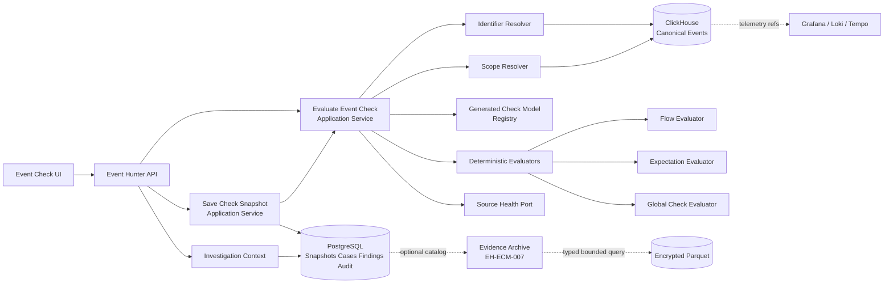
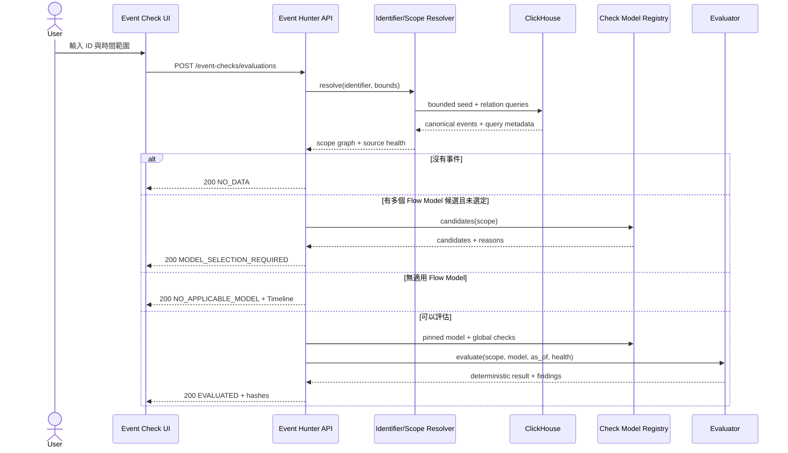
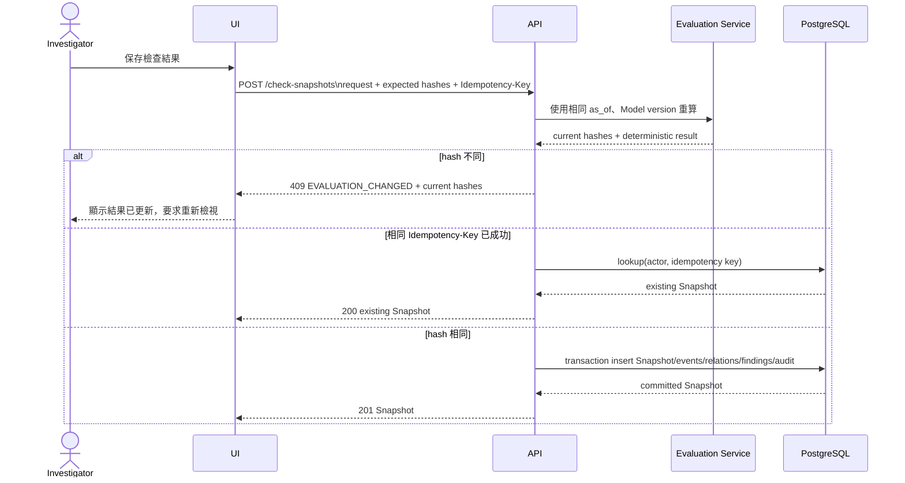
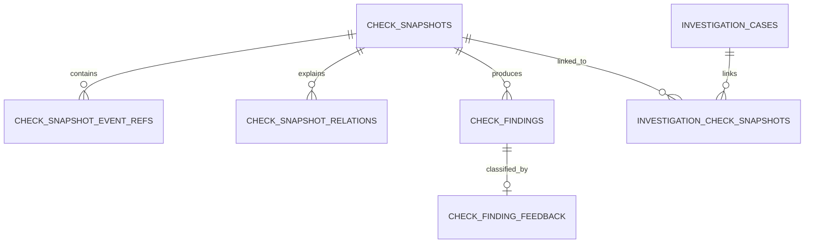

# Event Check Target Design

## 文件狀態與適用範圍

這是 `EH-ECM-000` 的設計基準，已由 `EH-ECM-001`～`EH-ECM-006` 依序轉成 executable schemas、
OpenAPI、Go domain、PostgreSQL migrations、React UI 與 E2E。本文件中的 contracts、domain、後端 endpoint、
Snapshot persistence、Event Check workspace、Check Models registry UI、legacy compatibility、完整 E2E、
source-failure 與 restart-persistence 均已是通過驗收的 canonical runtime。現行實作仍以
`openapi.yaml`、migrations 與 [Current Architecture](current-architecture.md) 為準。

本設計落實：

- [產品需求](../product/event-check-and-check-models-requirements.md)
- [ADR-005：Event Check 與 Check Model 架構](../decisions/adr-005-event-check-and-check-model-architecture.md)
- [ADR-006：Snapshot 與 Finding persistence](../decisions/adr-006-check-snapshot-and-finding-persistence.md)
- [ADR-007：Evidence Archive](../decisions/adr-007-duckdb-parquet-evidence-archive.md)

精確 JSON Schema 與 OpenAPI component 已由 `EH-ECM-001` 凍結；若要改變本文件的資源邊界、狀態語意、
hash consistency 或資料 ownership，必須先更新 ADR 與 executable contracts。

## 1. 系統責任與元件



### 1.1 Context ownership

| 責任 | Owner | 說明 |
|---|---|---|
| Canonical event 與 processing attempt 查詢 | Event query port／ClickHouse | Append-only event plane；Event Check 不修改資料 |
| ID 解析與 scope graph | Event Check context | 建立 seed、事件集合、納入原因與排除原因 |
| Check Model 發布內容 | YAML／Git + generated Registry | Runtime 唯讀；已發布版本 immutable |
| Conformance result | Event Check context | 只依 request、events、health、Model 與 evaluator version 決定 |
| Snapshot／Finding | Event Check context／PostgreSQL | 明確保存後才建立；append-only |
| Case lifecycle | Investigation context／PostgreSQL | Mutable Aggregate，使用 optimistic lock |
| Feedback | Investigation context／PostgreSQL | Finding 的人工分類 current state；所有修改有 Audit |
| Archive catalog | PostgreSQL | `EH-ECM-007` 後續能力；DuckDB 不作 source of truth |

Event Check 不呼叫 production services 執行 command，也不發布業務 command topic。它可以產生平台內部的
Snapshot、Finding、Case suggestion 與後續 notification intent。

## 2. Evaluation 流程



### 2.1 固定順序

輸入來源的 row order 不得影響結果或 hash。事件先依下列 tuple 建立 total order：

```text
(occurred_at,
 aggregate_type,
 aggregate_id,
 sequence,
 kafka_topic,
 kafka_partition,
 kafka_offset,
 event_id)
```

`sequence` 只在相同 producer aggregate 內具有業務順序意義；跨 aggregate 時只是 deterministic tie-break。
Model 若要求 causation 或 business relation，必須使用 scope graph edge，不得把上述排序誤當因果關係。

### 2.2 Source health gate

| Source health | 缺少預期事件時的行為 |
|---|---|
| `HEALTHY` | Deadline 成熟後可以判為 `VIOLATED` |
| `STALE` | 可以呈現已讀到的事件，但 absence-based 規則回 `INCONCLUSIVE` |
| `PARTIAL` | 可以執行正向命中；需要完整集合的否定判斷回 `INCONCLUSIVE` |
| `UNAVAILABLE` | API 回 `503 SOURCE_UNAVAILABLE`，不產生業務結果 |

Source health 至少包含 canonical event store readiness、查詢涵蓋區間、ingestion watermark 或等價的新鮮度
證據，以及被截斷／超限狀態。達到 scope 上限不是 `HEALTHY` 的完整集合，必須回 `PARTIAL`。

### 2.3 Scope 上限

平台 hard limits 固定為：

- 最長 7 天；
- 最多 10,000 events；
- 最多 20 correlations；
- relationship depth 最多 3。

Model 可以縮短 window、降低 event／correlation limit 或 relation depth，不得放寬平台限制。超過限制時，
API 回 `422 SCOPE_LIMIT_EXCEEDED`；若查詢在執行中才發現被截斷，回可檢視的 `PARTIAL` scope 與
`INCONCLUSIVE`，不得悄悄丟棄後仍宣稱 `CONFORMANT`。

## 3. HTTP resource design

本節已由 `EH-ECM-001`／`EH-ECM-003` 寫入 `openapi.yaml` 並接上 runtime handlers。

| Method／Path | operationId | 最低角色 | 用途 |
|---|---|---|---|
| `POST /api/v1/event-checks/evaluations` | `evaluateEventCheck` | `VIEWER` | 解析 scope、選擇或套用 Model、即時計算；不保存 |
| `GET /api/v1/check-models` | `listCheckModels` | `VIEWER` | 列出 Flow Models、Global Checks、版本與 applicability |
| `GET /api/v1/check-models/{modelId}/versions/{version}` | `getCheckModelVersion` | `VIEWER` | 讀取 immutable Model detail、checksum 與 source path |
| `POST /api/v1/check-snapshots` | `createCheckSnapshot` | `INVESTIGATOR` | 重新計算並以 hashes 驗證後保存 Snapshot |
| `GET /api/v1/check-snapshots` | `listCheckSnapshots` | `VIEWER` | 依 identifier／status 列出安全 Snapshot summary 與 stable keyset cursor |
| `GET /api/v1/check-snapshots/{snapshotId}` | `getCheckSnapshot` | `VIEWER` | 讀取 Snapshot、event metadata、relations 與 Findings |
| `PATCH /api/v1/check-findings/{findingId}/feedback` | `classifyCheckFinding` | `INVESTIGATOR` | 以 optimistic lock 更新 Finding 人工判定；Finding 本身不變 |
| `GET /api/v1/investigations/{investigationId}/check-snapshots` | `listInvestigationCheckSnapshots` | `VIEWER` | 列出 Case 已連結的 Snapshots |
| `POST /api/v1/investigations/{investigationId}/check-snapshots` | `attachInvestigationCheckSnapshot` | `INVESTIGATOR` | 以 `If-Match` 將既有 Snapshot 加入 Case |

`保存結果` 只建立 Snapshot；`建立案件` 採三步驟：必要時 `createCheckSnapshot`，再呼叫既有
`createInvestigation`，最後以 attach operation 連結；`加入案件` 則省略建案、直接選擇既有 Case 後 attach。
目前跨 resource 操作不是單一 transaction，因此 UI 必須顯示部分成功狀態：案件若已建立但 attach 失敗，
保留案件連結並允許重試。後端若日後提供 composite command，也必須使用單一 PostgreSQL transaction 或
可觀察、deletion-free 的補償語意，不能形成找不到的 Snapshot。

### 3.1 Evaluate request

概念 schema：

```yaml
identifier:
  type: EVENT_ID | TRACE_ID | CORRELATION_ID | AGGREGATE_ID | BUSINESS_KEY | AUTO
  value: string
  qualifier:                         # AUTO ambiguous 或 aggregate/business key 時使用
    aggregate_type: string?
    business_key_name: string?
from: RFC3339 timestamp
to: RFC3339 timestamp
model:
  id: string                         # 可省略，由 candidate resolution 決定
  version: integer
scope_adjustments:
  include:
    - event_id: string
      reason: string
  exclude:
    - event_id: string
      reason: string
```

規則：

- `from < to`，`to` 同時成為 `as_of`；
- `AUTO` 只做 deterministic type resolution，無法唯一判定時回候選，不靠字串外觀硬猜；
- include event 必須在平台 window 內且可透過 event ID 唯一取得；每筆 adjustment 必須有非空 reason；
- Model ID 與 version 必須一起出現；不得只指定 `latest`；
- request body 與 response 都不得包含 raw SQL、ClickHouse expression、filesystem path 或 arbitrary URL。

### 3.2 Evaluate response envelope

所有 deterministic product states 使用 `200`，讓 UI 能顯示下一步，而不是將「沒資料」當 transport error：

```yaml
resolution_status: NO_DATA | IDENTIFIER_SELECTION_REQUIRED |
                   MODEL_SELECTION_REQUIRED | NO_APPLICABLE_MODEL | EVALUATED
normalized_request: {}
source_health: {}
scope:
  mode: STANDARD_SCOPE | CUSTOM_SCOPE
  seeds: []
  events: []
  excluded_events: []
  relationships: []
  limits: {}
identifier_candidates: []
model_candidates: []
model: {}
result: {}                            # 僅 EVALUATED 時存在
event_set_hash: string?               # 有已解析 scope 時存在
evaluation_hash: string?              # EVALUATED 時存在
warnings: []
```

`result` 至少包含 Check status、Business outcome、Expectations、root／child Flow results、Global Check results、
Findings、unmapped events、candidate paths、evaluator contract version 與 evaluator build version。Frontend 只能
呈現後端結果，不另行推導 conformance。

### 3.3 Error contract

| HTTP | code | 用途 |
|---|---|---|
| `400` | `MALFORMED_REQUEST` | JSON／timestamp 無法解析 |
| `401`／`403` | 現行 auth codes | 未登入或角色不足 |
| `409` | `EVALUATION_CHANGED` | 保存前重算的 event set 或 result hash 已改變 |
| `409` | `MODEL_VERSION_UNAVAILABLE` | 指定的已發布 Model 無法再由 Registry 取得 |
| `409` | `CASE_VERSION_CONFLICT` | attach 時 `If-Match` 已過期 |
| `422` | `VALIDATION_FAILED` | 可解析但違反 typed contract |
| `422` | `SCOPE_LIMIT_EXCEEDED` | 請求本身超過 hard limits |
| `429` | `RATE_LIMITED` | bounded abuse protection |
| `503` | `SOURCE_UNAVAILABLE` | canonical source 無法完成查詢 |
| `504` | `SOURCE_TIMEOUT` | bounded source query 超時 |

Error body 沿用平台標準 `code`、`message`、`request_id`、`details`，不得包含 SQL、secret、raw payload 或
內部 path。

## 4. Snapshot save consistency



### 4.1 Save request

`CreateCheckSnapshotRequest` 包含：

- 原始 `EventCheckEvaluationRequest`，不可只送 result；
- `expected_event_set_hash`；
- `expected_evaluation_hash`；
- optional `retention_profile` reference（主線只能是未啟用或 `REFERENCE_ONLY`）；
- HTTP `Idempotency-Key`。

Idempotency identity 為 authenticated actor + endpoint + key。相同 key 但不同 normalized request 回
`409 IDEMPOTENCY_KEY_REUSED`。Key 必須具有限制長度，不可被記入 application logs 的 payload 欄位。

### 4.2 Canonical hashes

Hash 使用 SHA-256 小寫 hex 與 RFC 8785 JSON Canonicalization Scheme。Event metadata、excluded reasons、
relations、Model checksum、source health 與 deterministic result 的 exact machine schemas 由 `EH-ECM-001`
凍結，並以 golden vectors 驗證 Go／test tooling 產生相同值。

```text
event_set_hash = SHA256(JCS({
  scope_contract_version,
  included_event_metadata_and_payload_checksums,
  excluded_event_metadata_and_reasons,
  relationship_edges
}))

evaluation_hash = SHA256(JCS({
  evaluation_contract_version,
  normalized_request,
  model_ref_and_checksum,
  event_set_hash,
  source_health,
  deterministic_result
}))
```

任何 nondeterministic 欄位（request ID、執行耗時、server timestamp、display label locale）不可進 hash。
即時 evaluation 的 Finding `id` 為 `null`；明確保存 Snapshot 時才由後端配置 UUID。這些 storage-assigned
Finding IDs 不進 `evaluation_hash`，因此相同 evaluation 在保存前後仍保持相同 deterministic hash。

### 4.3 Source availability 的階段邊界

`EH-ECM-003` 保存 event reference 當下的 `source_available`，並保留最少 metadata 與 payload checksum；
不保存 raw payload。讀取 Snapshot 時重新對照 ClickHouse TTL、archive availability 與 expired 狀態屬於選用的
`EH-ECM-007`。在該功能啟用前，UI 不得把保存當下的 `source_available=true` 解讀成永久可展開 payload。

## 5. Logical PostgreSQL model

### 5.1 Aggregate relationships



### 5.2 `check_snapshots`

| Column | Logical type | Contract |
|---|---|---|
| `id` | UUID | Primary key |
| `provenance` | VARCHAR | `LIVE_EVALUATION` 或 `LEGACY_PATTERN_MIGRATION` |
| `created_by`／`created_by_role` | VARCHAR | Authenticated actor snapshot |
| `seed_identifier_type`／`seed_identifier_value` | VARCHAR | Normalized seed；value 依既有 masking policy |
| `scope_mode` | VARCHAR | `STANDARD_SCOPE`、`CUSTOM_SCOPE`、`LEGACY_CASE_ANALYSIS` |
| `window_from`／`window_to`／`as_of` | TIMESTAMPTZ | UTC；`as_of = window_to` |
| `model_id`／`model_version` | VARCHAR／INTEGER | Published primary Flow Model |
| `model_checksum`／`model_source_path` | VARCHAR | Immutable execution reference |
| `check_status` | VARCHAR | 三維結果中的 Check status |
| `business_outcome_category`／`business_outcome_code` | VARCHAR | Category 與 domain code 分開 |
| `source_health_status` | VARCHAR | Snapshot 當下健康狀態 |
| `event_set_hash`／`evaluation_hash` | CHAR(64) | Lowercase SHA-256 |
| `result_schema_version` | INTEGER | Snapshot JSON 相容版本 |
| `result_document` | JSONB | Deterministic result；不含 raw payload |
| `idempotency_key_hash` | CHAR(64) | Actor-scoped lookup；不保存原 key |
| `retention_profile_id`／`retention_profile_version` | nullable | `EH-ECM-007` hook |
| `created_at` | TIMESTAMPTZ | Server time；不進 evaluation hash |

Constraints／indexes：

- `UNIQUE(created_by, idempotency_key_hash)`；
- `window_from < window_to`、`as_of = window_to`；
- Model version、checksum 對 live Snapshot 必填；legacy synthetic Snapshot 可使用明確 legacy Model reference；
- indexes 至少涵蓋 `created_at`、seed identifier、Model ID／version 與 `evaluation_hash`；
- 不提供 `updated_at`、update 或 delete repository method。

### 5.3 `check_snapshot_event_refs`

| Column group | Contract |
|---|---|
| Identity | `snapshot_id`、`event_id`、`ordinal`、`disposition` (`INCLUDED`／`EXCLUDED`) |
| Event metadata | `event_type`、`occurred_at`、`producer`、`aggregate_type`、`aggregate_id` |
| Correlation | `correlation_id`、nullable `trace_id` |
| Integrity | `payload_sha256`；不保存 payload |
| Scope decision | nullable `adjustment_reason`、`source_expired` 只在 read model 動態判斷，不回寫 row |

`UNIQUE(snapshot_id, event_id)`；excluded event 也保留最少 metadata 與 reason。`ordinal` 反映第 2.1 節的
deterministic order，不取代 event-time 或 aggregate sequence 語意。

### 5.4 `check_snapshot_relations`

每列保存 `snapshot_id`、nullable `from_event_id`、`to_event_id`、`relation_type`、`source_field`、nullable
`source_model_id`／`source_rule_id` 與 deterministic ordinal。`relation_type` 至少支援：

- `SEED`
- `SAME_CORRELATION`
- `SAME_AGGREGATE`
- `CAUSATION`
- `BUSINESS_KEY`
- `PARENT_CHILD`
- `CUSTOM_INCLUDE`

Custom exclude 不建立假 edge，而由 event ref 的 disposition 與 reason 表達。

### 5.5 `check_findings`

| Column | Contract |
|---|---|
| `id`／`snapshot_id` | Finding identity 與 immutable Snapshot FK |
| `rule_kind` | `FLOW_EXPECTATION`、`MODEL_RULE` 或 `GLOBAL_CHECK` |
| `rule_id`／`rule_version`／`rule_checksum` | 精確 authoring source |
| `severity`／`code` | 可查詢的 normalized classification |
| `expectation_state` | nullable；Expectation finding 時保存 |
| `matched_conditions` | JSONB；deterministic condition summaries |
| `evidence_references` | JSONB；只允許 typed stable refs |
| `recommended_next_query` | Typed bounded query document；不得是任意 URL／SQL |
| `created_at` | Append time |

Finding immutable。相同 Snapshot／rule identity 只建立一次；legacy migration 必須保留既有 finding UUID。

### 5.6 `check_finding_feedback`

一個 Finding 最多一筆 current feedback，保存 `finding_id`、`status`、actor、role、comment、`lock_version`、
`created_at`、`updated_at`。修改使用 `If-Match`／optimistic lock，並在同一 transaction append Audit。
相容期既有 `classifyPatternFinding` endpoint 透過 adapter 操作同一份資料，不維護第二套狀態。

### 5.7 `investigation_check_snapshots`

N:M link 保存 `investigation_case_id`、`snapshot_id`、`linked_by`、`linked_by_role`、`linked_at`，組合唯一鍵避免
重複 attach。Attach transaction 必須：

1. 驗證 Case `If-Match` 與允許的 Case 狀態；
2. 建立 link；
3. 推進 Case `lock_version`；
4. append `CHECK_SNAPSHOT_ATTACHED` Audit。

移除 link 不在第一版 public API；Snapshot 與 Case 均不得因另一方狀態改變而被 cascade delete。

## 6. RBAC、資料遮罩與 Audit

| 能力 | VIEWER | INVESTIGATOR | ADMIN |
|---|---:|---:|---:|
| 執行 Event Check | 是 | 是 | 是 |
| 讀取 Check Model／允許的 Snapshot | 是 | 是 | 是 |
| 保存 Snapshot | 否 | 是 | 是 |
| 自訂 Scope | 否 | 是 | 是 |
| 建立 Case／attach Snapshot | 否 | 是 | 是 |
| 更新 Finding feedback | 否 | 是 | 是 |
| 取得 raw payload | 依既有獨立 permission；預設否 | 依既有獨立 permission；預設否 | 不因 ADMIN 自動取得 |

最低安全基線：

- Evaluation／Snapshot response 沿用 canonical event masking，Snapshot 本身永不保存 raw payload；
- 自訂 include／exclude 保存 actor、reason、event ID、request ID 與 Audit；
- Model source path 是 repository-relative allowlisted path，不接受 client path；
- Snapshot create、Case attach、feedback mutation 與 archive lifecycle 必須 Audit；
- Logs 只能記錄 request ID、actor ID、resource IDs、hashes 與 bounded counts，不記 identifier raw payload、
  event payload、Idempotency-Key 或 user feedback body；
- API 不暴露 arbitrary SQL、JSONPath、DuckDB extension、filesystem path 或 outbound URL；
- response limits、query timeout、rate limit 與 cancellation 必須一路傳到 ClickHouse query port。

## 7. Legacy migration and cutover

### 7.1 Expand／backfill／compatibility／contract

1. **Expand**：新增 Snapshot、event refs、relations、generalized Finding／feedback 與 Case link tables；舊 API
   仍使用 compatibility adapter。
2. **Backfill**：每個可遷移的 legacy Case analysis 建立 `LEGACY_CASE_ANALYSIS` Snapshot，保留 finding UUID、
   feedback 與 Case 關係；缺少的 event metadata、hash 或 grouping 標成 partial，不猜測。
3. **Compatibility**：舊 Journey、Pattern、Saved Search、Evidence 與 URL 轉成新 typed request／read model；固定
   fixtures 對照新舊 evaluator。
4. **Contract**：只有 `EH-ECM-006` 全數通過且 rollback window 結束後，才能移除 legacy direct Case FK、
   舊 registry 與舊 evaluator。移除另需明確 migration release note。

### 7.2 Rollback boundary

在 contract 階段前，feature flag 可以把入口切回現行 Timeline／Journey／Pattern runtime；新 tables 保留且不
刪除。已保存的 Snapshot 仍可唯讀，不因 UI rollback 被改寫。Rollback 不回寫或合併 legacy findings，也不
回滾 canonical events。

## 8. Evidence Archive hook

`EH-ECM-001`～`EH-ECM-006` 不依賴 DuckDB、Parquet、object storage 或 key provider。主線只預留 nullable
Retention Profile reference 與 archive links。`EH-ECM-007` 啟用後：

- PostgreSQL 仍保存 archive catalog 與 lifecycle；
- DuckDB 只能透過 server-defined typed filters 讀取 allowlisted immutable Parquet objects；
- Profile 與資料分類決定可封存欄位，使用者不能放寬；
- archive 失敗不影響 Snapshot、Finding 或 Case 正確性；
- purge 有 bounded target、dry-run、Audit、checksum 與 recovery contract。

## 9. 已凍結的 executable artifacts

`EH-ECM-001` 已完成並交付：

1. Check Model JSON Schema 與 versioning／checksum rules；
2. identifier、scope、relationship、source health 與 evaluation schemas；
3. Snapshot create／read 與 generalized Finding schemas；
4. RFC 8785 hash golden vectors；
5. every-state fixtures：success、expected failure、compensated、in progress、reminder、violation、
   late satisfied、unmapped、reasonable repeat、duplicate ID、cross-correlation child flow、inconclusive、ambiguous；
6. generated registry drift check；
7. OpenAPI operation／error examples；
8. legacy Journey／Pattern expectation mapping table。

這些 artifacts 由 `scripts/validate-contracts.py` 持續做 drift gate；migration、後端 API 與 `/event-check`、
`/check-models` workspace 與舊入口／deep links compatibility migration 已完成；`EH-ECM-006` 全量回歸、
source-failure 與 restart-persistence gates 亦已通過。舊 runtime／schema 的物理移除仍需另一個 migration
release 與完成 rollback window，不是本次 canonical UI cutover 的隱含動作。

## 10. 非目標

- production workflow orchestration、command、retry 或 compensation execution；
- continuous scanning、主動 Reminder、Finding 自動去重／重開或自動建案；
- runtime Model editor／發布 UI；
- fuzzy／LLM event relation；
- 無界查詢、任意 SQL 或 raw payload Snapshot；
- 以 DuckDB 取代 PostgreSQL，或讓 Evidence Archive 阻擋主功能 cutover。
