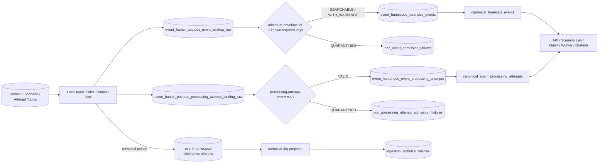

# ClickHouse-first ingestion：POC 結論與正式採用基準

- 狀態：`adopted`
- POC 驗證日期：2026-08-27
- 正式採用日期：2026-08-27
- 正式模式：domain events 與 processing attempts 均為 `clickhouse-mv`

本文件同時保存 POC 得到的設計結論與目前正式 runtime。舊文件中的 `candidate`、`legacy default` 與
「processing attempts 尚待替代」已失效；現況以本文件、`current-architecture.md`、
`contracts/platform/ingestion-mapping.yaml` 與 `compose.yaml` 為準。

## 1. 採用決策

Event Hunter 已移除兩個 Redpanda Connect ETL workers，改用：

```text
Kafka-compatible topics (Redpanda broker)
  → official ClickHouse Kafka Connect Sink v1.5.0
  → isolated raw landing tables
  → ClickHouse materialized admission rules
  → promoted events / promoted processing attempts
  → canonical read views
```

Redpanda broker 仍保留，因為它負責 Kafka protocol、topic、partition、offset 與緩衝；被移除的是
Redpanda Connect ETL runtime。Debezium Kafka Connect 也保留，負責把三個 demo service 的 transactional
outbox 發布到 Kafka。三者不是同一元件。

內部 service、connector、topic 與 table 名稱仍含 `poc`，是為了保留既有 Kafka Connect offsets、
migration history 與 rolling-upgrade 相容性，不代表此路線仍為 optional profile。

## 2. 正式資料流



Kafka 是傳輸與重播來源；Timeline、Journey、Pattern 與 Investigation 的歷史查詢全部來自 ClickHouse
canonical views，不會直接掃 Kafka。

## 3. Admission 語意

### Domain events

`minimum-envelope-v1` 判斷事件是否能可靠保存與搜尋，不冒充完整業務 JSON Schema 驗證。

會進入 `QUARANTINED`：

- 非 JSON、超過 1 MiB、缺少必要 envelope 欄位。
- `eventVersion=0`、`sequence=0` 或 payload 不是 object。
- 已知 Order／Payment／Shipping／Return event type 缺少必要 payload keys。

仍可查詢但標示 `SEARCHABLE_WITH_WARNINGS`：

- 未知 event type 或 version。
- 無效但非必要的 trace ID。
- event type 與 aggregate type 不一致。

因此 `SEARCHABLE` 不等於 `CONTRACT_VALID`。需要依 payload 自動執行業務動作的 consumer，仍應採用
完整 event-specific schema；Event Hunter 的目標是避免新領域事件因尚未登錄而完全無法調查。

### Processing attempts

`processing-attempt-contract-v1` 驗證 attempt/event/correlation、consumer、status、Kafka coordinates、
時間與 retry 欄位的一致性。合法資料提升到 promoted attempts；不合法資料只產生安全 failure summary，
不會偽造成 retry／DLQ 狀態。

## 4. 安全與失敗邊界

- raw landing 固定在 `event_hunter_poc` database，TTL 為 7 天。
- `grafana_reader` 不可讀 raw payload；Grafana 與一般 API 只能讀 promoted data 與安全摘要。
- safe failure 不保存 raw payload、exception message 或 stack trace，只保存來源座標、分類與 SHA-256。
- Sink 單筆 converter／sink poison 進 technical DLQ，再由 projector 寫入安全 read model。
- ClickHouse 暫時不可用時，connector retry 且不提前提交來源 offset。
- Sink 採 at-least-once；domain transport identity 是 `topic + partition + offset`，attempt identity 是
  `attempt_id`，read model 依此去除 redelivery 的重複呈現。

若未來提供 privileged raw reader，必須另建角色、限時核准、來源限制、Secret Manager 與 query audit；
不得擴大 `grafana_reader`。

## 5. Source of truth

- Runtime mode：`config/ingestion-cutover.env`
- Ingestion contract：`contracts/platform/ingestion-mapping.yaml`
- Domain Sink：`infra/kafka-connect-clickhouse/connectors/poc-raw-landing.json`
- Attempt Sink：`infra/kafka-connect-clickhouse/connectors/poc-processing-attempt-raw-landing.json`
- Event migration：`backend/migrations/clickhouse/00006_clickhouse_mv_ingestion_poc.sql`
- Canonical event views：`backend/migrations/clickhouse/00007_canonical_forensics_read_model.sql`
- Technical failures：`backend/migrations/clickhouse/00008_ingestion_technical_failures.sql`
- Attempt migration：`backend/migrations/clickhouse/00009_clickhouse_mv_processing_attempts.sql`

fresh-start migration 預設建立 ClickHouse-first canonical views；啟動腳本也會把舊 volume 留下的 canonical
views 對齊到 promoted tables。歷史 `forensics_events`／`event_processing_attempts` tables 暫時保留作
migration evidence，但沒有 writer，也不是 rollback runtime。

## 6. 可執行驗收

```bash
bash scripts/clickhouse-mv-poc-up.sh
bash scripts/test-clickhouse-mv-poc.sh
bash scripts/test-ingestion-pipeline.sh
bash scripts/test-clickhouse-mv-candidate-only-recovery.sh
bash scripts/test-clickhouse-mv-raw-purge.sh
bash scripts/test-e2e.sh Backend
```

相容 script／artifact 名稱仍含 `poc` 或 `candidate`，後續可另做非功能性 rename；它們目前驗證的是正式
runtime，而不是平行 shadow route。

2026-08-27 已完成的證據：

- domain POC + technical DLQ + processing-attempt POC：3/3 scenarios。
- Scenario Lab：16/16；Grafana auto-case：1/1。
- Backend Karate：18 features、108/108 scenarios。
- candidate-only recovery：舊 workers 不存在時，domain 與 attempts 都能在 ClickHouse outage 後由 Kafka
  backlog 恢復，API readiness 為 200 → 503 → 200。
- `test-ingestion-pipeline.sh`：invalid event 保留 raw 並安全隔離；duplicate attempt 最終只呈現一個 logical attempt。
- contract validation、Compose validation、fresh-start `dev-up.sh` 與 fixture loader 已對齊新 promoted tables。

## 7. 已接受的非阻擋缺口

依目前「先完成功能，不先壓測」決策，以下不阻擋本機 Phase 1.1 runtime：

- sustained load／soak、capacity ceiling 與 throughput benchmark。
- 高併發 duplicate／redelivery 壓力矩陣。
- 正式環境 raw retention、加密、資料分類、刪除、privileged access 與 query audit 政策核准。
- 逐 event-type 完整 JSON Schema admission worker；目前 known-event required-key gate 足以支援鑑識搜尋，
  但不應用於自動化業務決策。

正式 staging／production 前仍須完成 TLS、Secret Manager、SSO／RBAC、HA、RTO／RPO 與實際
backup／restore 演練；這些是部署產品化工作，不是 Redpanda Connect 替代功能缺口。
