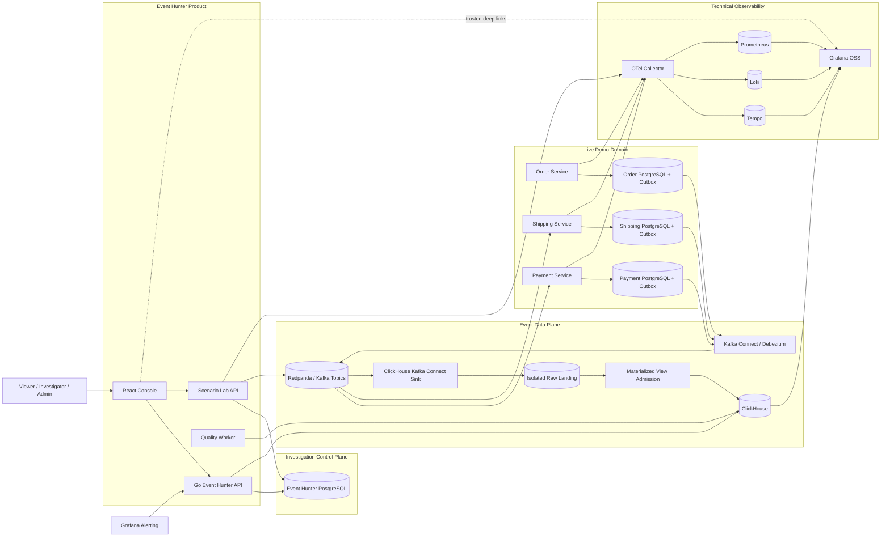
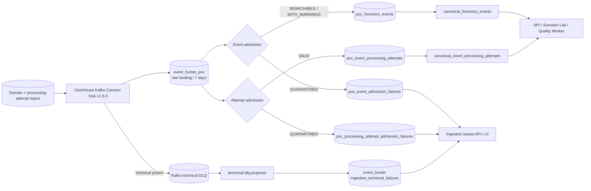
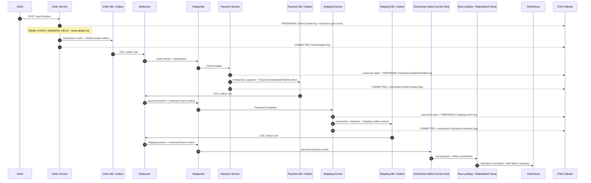
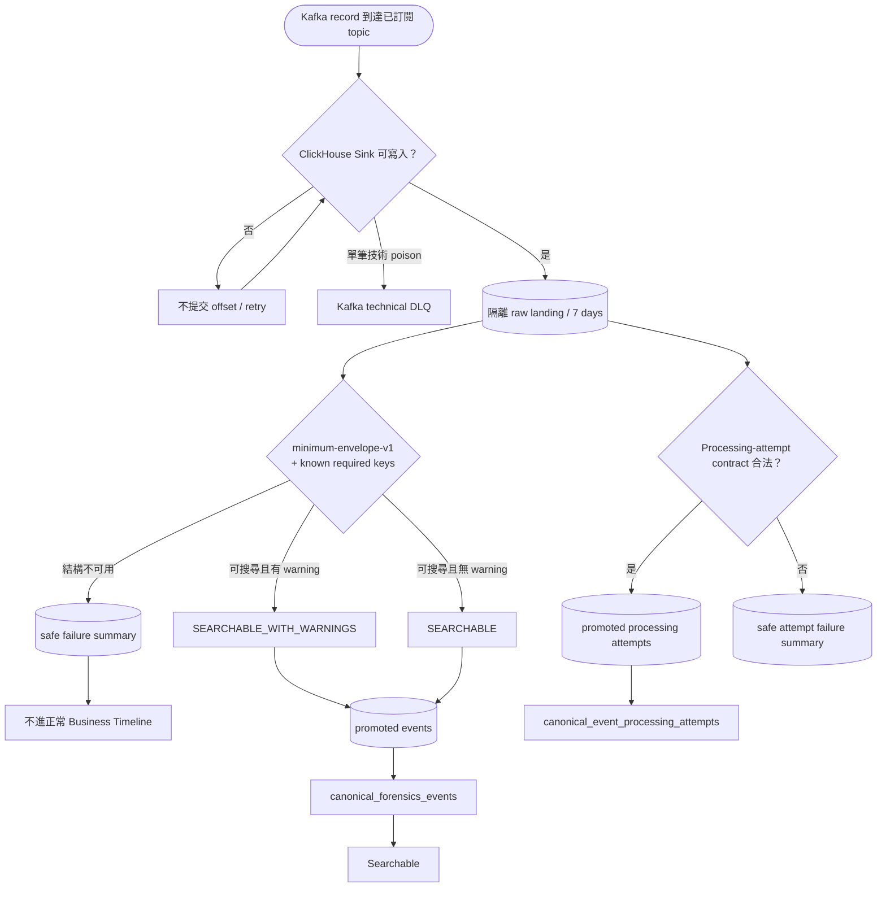
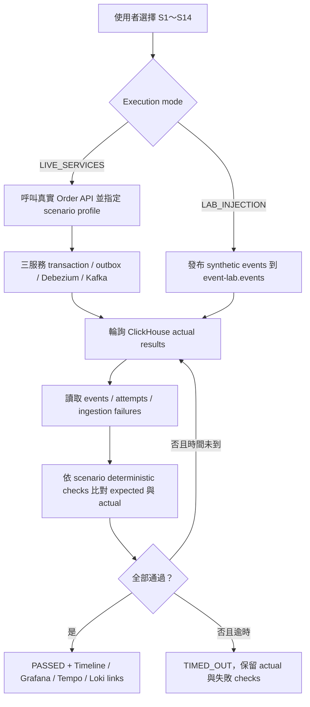
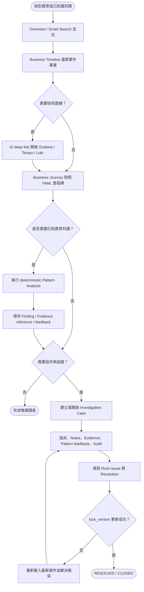
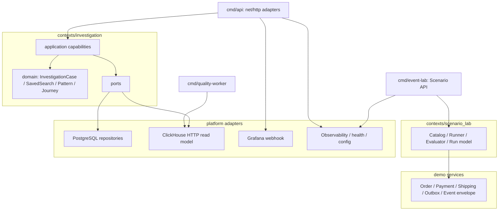

# Event Hunter Current Architecture

- 更新日期：2026-08-28
- 適用範圍：目前本機 Compose、Go backend、React frontend、正式 ClickHouse-first ingestion、OpenTelemetry 與 Phase 1.1 UI
- 不包含：尚未實作的 Event／Topic Registry、Temporal workflow、Projection Rebuild、Sandbox Replay、Production Redrive

本文件是 Event Hunter 目前架構的主要入口，只描述 repository 與 Compose 中可執行、可測試的系統。
README 刻意只保留產品介紹與快速操作；元件責任、資料流、ingestion、observability、資料所有權與
backend dependency 都集中在本文件。未來構想保留在 Phase 2／3 規劃，不混入目前 runtime 主圖。

## 1. 系統全貌

關鍵邊界：

- Kafka 負責事件傳遞與緩衝，不是 Business Timeline 的歷史查詢來源。
- ClickHouse 保存合法 canonical events、processing attempts、ingestion failures 與品質 read models。
- PostgreSQL 保存案件、Notes、Evidence references、Pattern findings／feedback、Audit、Saved Searches 與 Scenario runs。
- Tempo／Loki／Prometheus 保存 trace／log／metric；Event Hunter 只保存識別碼與可信 deep-link context。
- Event Hunter API 不是正式事件 ingestion endpoint；正式事件經 Kafka ingestion pipeline 進入 ClickHouse。

### 1.1 正式 ClickHouse-first ingestion

2026-08-27 已正式採用同一條路線處理 domain events 與 processing attempts：

- Redpanda Connect domain／attempt workers 與其設定已移除；Redpanda broker、Debezium Kafka Connect 與
  ClickHouse Kafka Connect Sink 是不同責任，broker 與 Debezium 仍保留。
- runtime readers 一律查兩個 canonical views，不直接綁定 promoted table 名稱。
- raw database 不授權給 `grafana_reader`；Grafana 只讀安全 failure summary。
- `/ingestion-issues` 將 historical contract failures、event／attempt admission quarantine 與 technical DLQ 統一為
  安全 read model；不查 raw database，也不回傳 exception message 或 stack trace。
- technical projector 是預設服務；成功寫入 ClickHouse 後才 commit Kafka offset，暫時失敗會原地重試。
- transport identity 仍是 `topic + partition + offset`；目前 Sink 採 at-least-once。
- `SEARCHABLE` 只代表 envelope 可可靠搜尋；未知 event type/version 與無效 optional trace metadata
  會成為 `SEARCHABLE_WITH_WARNINGS`，不冒充完整業務契約已驗證。
- 13 種已知事件另檢查必要 payload keys；缺少時以 `SCHEMA_VIOLATION` 隔離。欄位型別、enum、格式與
  條件式規則仍不是完整 JSON Schema validation。
- canonical API、OpenAPI client 與 Timeline UI 會保留 `admission_status`、`quality_flags`、
  `admission_profile`；warning 在事件列表與詳細資訊都有明確的人類可讀提示。
- `config/ingestion-cutover.env` 的正式預設為 domain 與 attempts 都採 `clickhouse-mv`。fresh-start migration
  與啟動腳本都會對齊 canonical views；historical tables 僅保留 migration evidence，沒有 writer。
- 內部 service、connector、table 仍含 `poc` 是為了保留 offsets 與 migration history，不表示路線仍為選用。
- 完整範圍、最低契約限制與驗收證據見
  [clickhouse-mv-ingestion-poc.md](clickhouse-mv-ingestion-poc.md)。
- outage／restart 與 bounded raw purge 分別由
  `scripts/test-clickhouse-mv-functional-recovery.sh`、`scripts/test-clickhouse-mv-candidate-only-recovery.sh`、
  `scripts/test-clickhouse-mv-raw-purge.sh` 保護。相容名稱暫時保留，但所有正式驗證都要求舊 workers 不存在，
  domain 與 attempts 都只經新路線形成資料。

## 2. Live Domain Event 與 Trace 流程

三個服務使用顯式 OpenTelemetry SDK、`otelhttp`、`otelslog` 與 franz-go `kotel`。Outbox 保存
`trace_parent`／`trace_state`，Debezium 轉成 Kafka `traceparent`／`tracestate` headers，所以下游
consumer 能延續同一條 trace，而不是只靠相同的 correlation ID 拼接畫面。

事件 lifecycle logs 使用 `PREPARING`、`COMMITTED`、`FAILED` 三個 phase。`COMMITTED` 只代表 business
state 與 outbox row 已完成 local transaction，不代表 Debezium 已發布到 Kafka；Kafka delivery 必須再由
connector、processing attempt、consumer 的真實 partition／offset 與 `processed domain event` log 證明。
Producer-side Kafka coordinates 固定標示 unknown，不建立假的 broker 位置。完整訊息、欄位、安全邊界及
驗收見 [Live Event Observability Contract](live-event-observability-contract.md)。

## 3. Ingestion 活動圖

## 4. Scenario Lab 活動圖

Scenario catalog 目前固定為 S1～S14：S1、S12、S13、S14 使用真實三服務；S2～S11 使用隔離的
`event-lab.events`。劇本與 expected 固定，actual 與 PASS／FAIL 由後端回查實際資料後計算。

## 5. 使用者調查活動圖

Business Journey 是 YAML 規則對同一 correlation 事件集合的確定性解讀，不是 production workflow
state machine。里程碑狀態可由前置事件啟動，但卡片的 actual events 只列該里程碑自己的
`expected_event_types`。

## 6. Backend 模組與依賴方向

`contexts/investigation/application` 依使用者能力採 screaming architecture：

- `overview`
- `forensics`
- `event_search`
- `business_journey`
- `journey_profiles`
- `case_lifecycle`
- `evidence_attachment`
- `saved_search`
- `pattern_analysis`
- `pattern_effectiveness`
- `pattern_feedback`
- `alert_intake`

HTTP handlers 位於 composition root，目前使用標準庫 `net/http.ServeMux`；PostgreSQL 使用
`database/sql` + pgx driver；ClickHouse 查詢使用有 timeout、row／byte budget 的 HTTP read-model
adapter。Domain 不依賴 HTTP、PostgreSQL、ClickHouse、Grafana 或 OTel 套件。

## 7. 資料所有權

| Store | 目前保存內容 | 主要寫入者 | 主要讀取者 |
|---|---|---|---|
| Demo PostgreSQL ×3 | Order／Payment／Shipment 狀態與 transactional outbox | Demo services | Debezium、各 demo service |
| Redpanda | Domain events、Scenario events、processing attempts、restricted technical DLQ | Debezium、demo services、Scenario Lab、ClickHouse Sink failure route | Demo consumers、ClickHouse Kafka Connect Sink、technical projector |
| ClickHouse | 隔離 raw、promoted events／attempts、canonical views、failure／quality models | ClickHouse Sink／Materialized Views、technical projector、Quality Worker | Event Hunter API、Grafana、Scenario Lab observer |
| Event Hunter PostgreSQL | Cases、Notes、Evidence references、Findings／feedback、Audit、Saved Searches、Scenario runs | Event Hunter API、Scenario Lab | Event Hunter API、Scenario Lab |
| Tempo／Loki／Prometheus | Live 與明確標記的 synthetic telemetry | OTel Collector | Grafana、health／E2E probes |

## 8. 目前與未來邊界

| 能力 | 目前狀態 |
|---|---|
| Timeline、Journey、Journey Profile Registry、Case、Pattern、Scenario Lab、Guide | 已實作 |
| Grafana／Tempo／Loki deep links 與 signed Grafana alert intake | 已實作 |
| Event／Topic Registry 與 self-service onboarding | 未實作，不在本文件主圖 |
| Temporal case workflow | Compose 選用容器存在，但沒有 Event Hunter worker／workflow 實作 |
| Projection Rebuild、Sandbox Behavioral Replay | Phase 2／3 規劃，未實作 |
| Production Redrive | 明確不在本專案一般功能範圍 |

## 9. Source of truth

- Runtime topology：[compose.yaml](../compose.yaml)
- HTTP contract：[openapi.yaml](../openapi.yaml)
- Kafka contract：[contracts/asyncapi.yaml](../contracts/asyncapi.yaml)
- Topic topology：[contracts/platform/topic-topology.yaml](../contracts/platform/topic-topology.yaml)
- Ingestion runtime：[infra/kafka-connect-clickhouse](../infra/kafka-connect-clickhouse)
- Journey authoring：[contracts/journeys](../contracts/journeys)
- Pattern authoring：[contracts/patterns](../contracts/patterns)
- Backend capability boundaries：[application-screaming-architecture.md](application-screaming-architecture.md)
- Current architecture PlantUML：[event-hunter-architecture.puml](event-hunter-architecture.puml)
- Current activity diagram source：[event-hunter-activity.puml](event-hunter-activity.puml)
